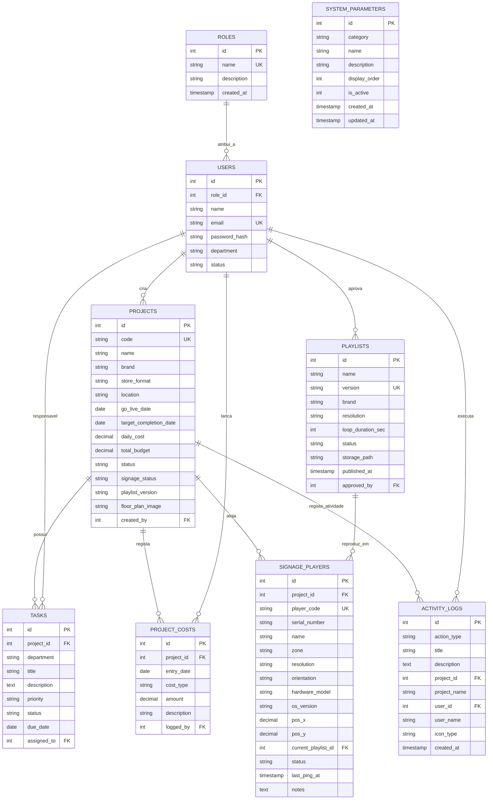
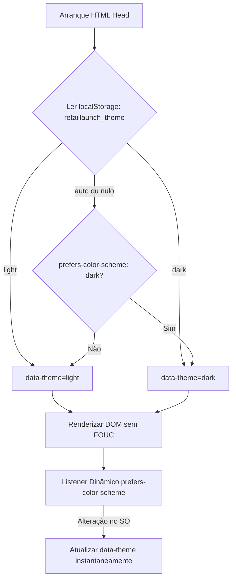

# Especificação da Arquitetura Técnica e Estrutural
## RetailLaunchOS • Gabinete Multimédia (Fnac / Darty)

Este documento documenta detalhadamente as estruturas técnicas, convenções de código, esquema de base de dados e camadas da aplicação implementadas no **RetailLaunchOS**.

---

## 1. Estrutura de Diretórios e Padrão Modular

A aplicação segue uma arquitetura modular por camadas (*Separation of Concerns*), permitindo escalar facilmente com novas APIs, autenticação e microserviços:

```text
RetailLaunchOS/
├── config/                          # Configurações globais e de infraestrutura
│   ├── app.js                       # Variáveis gerais, insígnias permitidas, portas
│   └── database.js                  # Caminhos e dialetos (SQLite / PostgreSQL)
├── database/                        # Camada de definição e persistência de dados
│   ├── schema.sql                   # DDL relacional (tabelas, índices e dados semente)
│   ├── retaillaunch.sqlite          # Ficheiro de base de dados SQLite (gerado automaticamente)
│   └── uploads/                     # Volume persistente de ficheiros multimédia (Fase 17)
│       └── floor_plans/             # Plantas arquitetónicas de lojas (PNG, JPEG, WebP, SVG)
├── public/                          # Ficheiros estáticos públicos
│   ├── css/
│   │   └── dashboard.css            # Folha de estilos vanilla com design system Fnac/Darty
│   └── js/                          # Scripts auxiliares e bibliotecas cliente
├── src/                             # Código-fonte principal da aplicação
│   ├── controllers/                 # Controladores REST e lógica de endpoints
│   │   ├── authController.js        # Autenticação JWT, troca de perfil e utilizadores
│   │   ├── projectController.js     # Gestão de aberturas de lojas e métricas
│   │   ├── taskController.js        # Checklist de marcos técnicos e progresso
│   │   ├── costController.js        # Registo de custos, diárias e sumários orçamentais
│   │   ├── signageController.js     # Catálogo de playlists, versionamento e monitorização de telas
│   │   ├── parameterController.js   # Gestão de parâmetros multimédia (modelos, zonas, resoluções)
│   │   ├── databaseController.js    # Telemetria, backup e migração atómica da base de dados
│   │   └── activityController.js    # Feed de auditoria operacional em tempo real (Fase 14)
│   ├── database/                    # Abstração de ligação e auto-bootstrap da BD
│   │   └── db.js                    # Conexão nativa via node:sqlite com WAL e PRAGMAs
│   ├── middleware/                  # Intercetores de pedidos
│   │   └── authMiddleware.js        # JWT nativo HMAC-SHA256, autenticação e guardas RBAC
│   ├── models/                      # Camada de acesso aos dados (Data Access Objects)
│   │   ├── User.js                  # Utilizadores, hashes PBKDF2 e validação de credenciais
│   │   ├── Role.js                  # Perfis RBAC e matriz granular de permissões
│   │   ├── Project.js               # Consultas parametrizadas, criação e KPIs
│   │   ├── Task.js                  # Marcos técnicos e toggle de estado
│   │   ├── Cost.js                  # Custos diários, agregações e sumário financeiro
│   │   ├── Playlist.js              # Versões de playlists, resoluções e catálogo central
│   │   ├── SignagePlayer.js         # Parque de telas, serial_number, associação e telemetria
│   │   ├── SystemParameter.js       # Parâmetros estruturais de hardware e multimédia
│   │   └── ActivityLog.js           # Rasto de auditoria de eventos e atividades recentes (Fase 14)
│   ├── routes/                      # Definição e mapeamento de rotas
│   │   ├── api/                     # Rotas de dados JSON (/api/v1/...)
│   │   │   └── projects.js          # Endpoints REST de projetos
│   │   └── web/                     # Rotas de visualização web HTML
│   │       └── dashboard.js         # Páginas do dashboard
│   └── views/                       # Vistas e templates da interface
│       └── pages/
│           └── dashboard.html       # Interface interativa do utilizador
├── Dockerfile                       # Contentorização baseada em Node.js 22 LTS Alpine
├── docker-compose.yml               # Orquestração para Synology Container Manager
├── package.json                     # Metadados e scripts de arranque
├── server.js                        # Servidor principal da aplicação (HTTP nativo/Express)
├── sync_github.sh                   # Script facilitador de commits e push para GitHub
├── MANUAL_SYNOLOGY.md               # Procedimentos de deploy e sync no NAS
└── MANUAL_UTILIZADOR_MODAIS.md      # Manual de utilização funcional para operadores
```

---

## 2. Base de Dados & Camada de Persistência

### 2.1. Motor SQLite Nativo (`node:sqlite`)
* **Implementação**: Em [`src/database/db.js`](file:///Users/daviscorreia/Antigravity%20/RetailLaunchOS/src/database/db.js), a aplicação utiliza o novo módulo nativo do Node.js (`node:sqlite` disponível em Node 22 e Node 24).
* **Vantagens**:
  * **Zero dependências externas**: Não requer pacotes npm como `better-sqlite3` ou `sqlite3`, eliminando compilações com `node-gyp` ou ferramentas C++ no Mac e no Synology NAS.
  * **Ultra-rápido**: Comunicação direta em memória e disco através de bindings C nativos do runtime V8.
* **Otimizações PRAGMA**:
  * `PRAGMA foreign_keys = ON;` — Garante a integridade referencial nas tabelas relacionais.
  * `PRAGMA journal_mode = WAL;` — Ativa o modo *Write-Ahead Logging* para leituras e escritas concorrentes sem bloqueios.

### 2.2. Mecanismo de Auto-Bootstrap
Na primeira execução da aplicação:
1. O ficheiro `src/database/db.js` verifica se a tabela `projects` existe na base de dados.
2. Caso não exista (base de dados nova ou limpa), lê e executa automaticamente o script [`database/schema.sql`](file:///Users/daviscorreia/Antigravity%20/RetailLaunchOS/database/schema.sql).
3. Cria todas as tabelas, índices e dados semente de teste sem intervenção manual.

### 2.3. Esquema Relacional de Dados (`database/schema.sql`)



---

## 3. Camada de Modelos (`src/models/`)

Os modelos encapsulam a lógica de negócio e queries SQL parametrizadas (evitando SQL Injection):

### 3.1. Modelo `Project.js`
* **`Project.findAll({ brand, status })`**:
  * Realiza `SELECT` com agregação de tarefas associadas (`total_tasks` e `completed_tasks`).
  * Calcula a percentagem real de progresso: `progress = round((completed_tasks / total_tasks) * 100)`.
* **`Project.findById(id)`**:
  * Suporta busca tanto por ID numérico como pelo código alfanumérico da loja (ex: `FNAC-CAS-2026`).
  * Agrupa os marcos técnicos (`tasks`), os custos diários registados (`project_costs`) e a contagem de ecrãs de Digital Signage.
* **`Project.create(data)`**:
  * Gera códigos de loja normalizados: `[MARCA]-[CIDADE]-[ANO]-[ALEATÓRIO]`.
  * Sanitiza e insere valores padrão para datas e orçamentos.
* **`Project.getKpis()`**:
  * Identifica a próxima abertura ativa: `SELECT * FROM projects WHERE go_live_date >= DATE('now') ORDER BY go_live_date ASC LIMIT 1`.
  * **Fase 9 (Refinamento Hero Card)**: O objeto `nextOpening` é enriquecido em tempo real com métricas da loja iminente:
    * `progress`: Percentagem de progresso real calculado com base nas tarefas técnicas concluídas.
    * `displaysCount`: Quantidade de displays/players associados à loja.
    * `formatsCount`: Contagem de formatos/resoluções distintas utilizadas na loja.
    * `playlistsState` & `playlistsStateClass`: Estado de associação de playlists (`100% OK`, `X a Associar` ou `0 Telas`).
  * Agrega em tempo real o rácio global de prontidão das telas (`signageReadiness`) e contadores operacionais (`signageStats`) diretamente a partir da tabela `signage_players`.
  * **Fase 10 (Gestão e Operações de Abertura • Layout Consolidado de 3 Cartões)**:
    * `planningProgress`: Agrega o progresso de planeamento de todas as lojas ativas (`percentage`, `totalTasks`, `completedTasks`, `pendingTasks`, `activeStoresCount`).
    * `checklistTasks`: Contabiliza tarefas pendentes globais com desagregação por prioridade (`critical`, `high`, `medium`, `low`).
    * `dueSoonTasks`: Calcula tarefas com prazo de entrega na semana corrente (próximos 7 dias) e tarefas em atraso (`overdue`, `thisWeek`, `total`).
    * `Project.create(data)`: Atualizado para auto-inicializar automaticamente 4 tarefas técnicas padrão essenciais para qualquer nova abertura criada.
    * **Arquitetura de Apresentação Superior (3 Cartões de Alta Densidade)**:
      1. *Próxima Abertura*: Contagem decrescente, displays, formatos e estado das playlists.
      2. *Planeamento Lojas*: Renderizado via `renderStoresPlanningCard` com lista dinâmica de lojas, nomes, badges de marca e barras de progresso individuais.
      3. *Checklists & Prazos*: Unifica em duas colunas internas de alta densidade o controlo de tarefas pendentes e o radar de alertas Due Soon da semana.

### 3.2. Modelo `Task.js` (Fases 2 & 10)
* **`Task.findAllGlobal(filters)` (Novo na Fase 10)**:
  * Lista tarefas de todas as lojas do sistema com `LEFT JOIN` a `projects` (nome da loja, código, insígnia, estado) e `users` (nome do técnico atribuído).
  * Suporta filtros dinâmicos: `status` (`pending`, `concluido`), `scope` (`due_soon`, `overdue`) e `projectId`.
  * Calcula em tempo de execução SQLite os campos derivados de urgência:
    * `is_overdue`: `due_date < hoje AND status != 'concluido'`.
    * `is_due_soon`: `due_date >= hoje AND due_date <= hoje + 7 dias AND status != 'concluido'`.
    * `days_remaining`: Dias inteiros restantes até à data limite.
  * Ordenação hierárquica de urgência: prioridades críticas primeiro, seguida da proximidade do prazo de entrega.
* **`Task.findByProject(projectId)`**:
  * Lista todas as tarefas associadas a uma loja, ordenadas por prioridade (`critical`, `high`, `medium`, `low`) e prazo de entrega.
  * Realiza `LEFT JOIN` com `users` para obter o nome do responsável.
* **`Task.create(data)`**:
  * Regista uma nova tarefa técnica vinculada a `project_id`.
* **`Task.toggleStatus(id)`**:
  * Alterna instantaneamente entre `concluido` (definindo `completed_at = CURRENT_TIMESTAMP`) e `pendente`.
* **`Task.update(id, data)` / `Task.delete(id)`**:
  * Atualiza metadados da tarefa ou elimina o registo.
* **`Task.getStats(projectId)`**:
  * Retorna contagens agregadas `{ total, completed, inProgress, pending, progress }` para recálculo imediato na interface.

### 3.3. Modelo `Cost.js` (Fase 3)
* **`Cost.findByProject(projectId)`**:
  * Lista todos os lançamentos financeiros vinculados ao projeto, com ordenação por data decrescente e `LEFT JOIN` com a tabela `users` para identificar o autor do registo.
* **`Cost.findById(id)`**:
  * Procura um registo de custo individual pelo seu ID primário.
* **`Cost.create(data)`**:
  * Insere uma nova despesa ou diária na tabela `project_costs` (`project_id`, `entry_date`, `cost_type`, `amount`, `description`, `logged_by`).
* **`Cost.delete(id)`**:
  * Remove um registo de despesa e devolve confirmação booleana.
* **`Cost.getProjectFinancialSummary(projectId)`**:
  * Calcula em tempo real o sumário financeiro da loja: `totalBudget`, `totalSpent`, `remainingBudget`, `budgetExecutionPercent`, `costsByType` (agrupamento por categoria de custo) e a lista completa de despesas.
* **`Cost.getGlobalSummary()`**:
  * Agrega os totais financeiros de todo o ecossistema: total gasto, despesa acumulada no mês corrente e distribuição de gastos por tipo de custo.

### 3.4. Modelo `Playlist.js` (Fase 4)
* **`Playlist.findAll({ brand, status, resolution })`**:
  * Lista todas as playlists do catálogo central com suporte a filtros dinâmicos por insígnia, estado de publicação e resolução.
  * Realiza agregação relacional com `signage_players` para contabilizar o número de telas associadas a cada playlist (`assigned_players_count`).
* **`Playlist.findById(id)`**:
  * Obtém os metadados da playlist pelo ID primário, incluindo o nome do utilizador aprovador (`approved_by_name`).
* **`Playlist.create(data)`**:
  * Regista uma nova versão de playlist (`name`, `version`, `brand`, `resolution`, `loop_duration_sec`, `storage_path`, `approved_by`).
* **`Playlist.updateStatus(id, status)`**:
  * Altera o ciclo de vida da playlist (`rascunho`, `aprovado`, `em_revisao`, `obsoleto`), registando o timestamp `published_at = CURRENT_TIMESTAMP` no ato de aprovação.
* **`Playlist.getStats()`**:
  * Fornece estatísticas consolidadas do repositório: total de playlists, ativas/aprovadas, em rascunho e obsoletas.

### 3.5. Modelo `SignagePlayer.js` (Fase 4 & 14)
* **`SignagePlayer.findByProject(projectId)`**:
  * Lista todas as telas/players instalados numa loja específica, com dados completos da playlist associada (`playlist_version`, `playlist_name`, `resolution`) e o identificador único `serial_number`.
* **`SignagePlayer.findAll({ status, brand, projectId })`**:
  * Retorna o parque global de ecrãs de todas as lojas, com detalhes do projeto (loja, código, insígnia), playlist vinculada e `serial_number`.
* **`SignagePlayer.create(data)`**:
  * Adiciona um novo ecrã ao projeto ou catálogo global com validação e geração automática de código (`player_code`), `serial_number` (sanitizado com trim), zona, orientação, IP, MAC e modelo de hardware.
* **`SignagePlayer.update(id, data)`**:
  * Permite reatribuir playlists, atualizar `serial_number`, endereços IP, notas de instalação ou alterar o estado operacional.
* **`SignagePlayer.ping(id)`**:
  * Simula/executa telemetria e teste de conectividade com o player, atualizando `last_ping_at = CURRENT_TIMESTAMP` e definindo o estado como `online`.
* **`SignagePlayer.delete(id)`**:
  * Remove o registo de um ecrã/player da base de dados.
* **`SignagePlayer.getGlobalSignageStats()`**:
  * Consolida métricas em tempo real de todo o parque: total de ecrãs, contagem por estado (`online`, `offline`, `syncing`, `testing`) e rácio de prontidão (`readiness_percentage`).

### 3.6. Modelo `User.js` (Fase 5)
* **`User.verifyCredentials(email, password)`**:
  * Valida credenciais corporativas calculando o hash PBKDF2 (`node:crypto`) com 10.000 iterações ou aceitando a palavra-passe padrão de ambiente piloto (`fnac2026`). Retorna o utilizador com dados do seu perfil associado (`role_name`).
* **`User.findById(id)`**:
  * Retorna o operador por ID primário com o seu papel (`role`), departamento e estado.
* **`User.findByEmail(email)`**:
  * Localiza o utilizador pelo endereço de email institucional.
* **`User.findByRole(roleName)`**:
  * Permite comutação rápida de perfil (1-clique) no piloto, retornando o utilizador representativo de cada perfil (`admin`, `multimedia_user`, `store_manager`, `viewer`).
* **`User.findAll()`**:
  * Retorna todos os utilizadores registados no sistema com respetivo cargo e departamento.

### 3.7. Modelo `Role.js` (Fase 5)
* **`Role.findAll()`**:
  * Lista os 4 papéis do sistema e as suas descrições funcionais.
* **`Role.getPermissionsMatrix(roleName)`**:
  * Retorna o mapa booleano de privilégios (`canCreateProject`, `canDeleteProject`, `canManageTasks`, `canDeleteTasks`, `canManageCosts`, `canManageSignage`, `canPingPlayers`, `canManageUsers`, `canManageConfig`).

### 3.8. Modelo `SystemParameter.js` (Fase 11)
* **`SystemParameter.findAll(category)`**:
  * Retorna os parâmetros ativos filtrados por categoria ou todos ordenados por `display_order, name`.
* **`SystemParameter.findGrouped()`**:
  * Retorna os parâmetros particionados num único objeto com as chaves `hardware_models`, `zones` e `resolutions`.
* **`SystemParameter.findById(id)`**:
  * Localiza um parâmetro individual pelo seu identificador primário.
* **`SystemParameter.findByCategoryAndName(category, name)`**:
  * Verifica duplicados antes da inserção.
* **`SystemParameter.create(data)`**:
  * Insere um novo parâmetro com `category`, `name`, `description`, `display_order` e `is_active`.
* **`SystemParameter.update(id, data)`**:
  * Atualiza o nome, descrição, ordem ou estado de ativação de um parâmetro existente.
* **`SystemParameter.delete(id)`**:
  * Remove fisicamente o parâmetro da base de dados.

### 3.9. Modelo `ActivityLog.js` (Fase 14)
* **`ActivityLog.log({ action_type, title, description, project_id, project_name, user_id, user_name, icon_type })`**:
  * Cria de forma não bloqueante um novo registo de auditoria com resolução automática de loja (`project_name`) e utilizador (`user_name`).
* **`ActivityLog.getRecent(limit = 15)`**:
  * Retorna as atividades operacionais mais recentes ordenadas por `created_at DESC, id DESC`.
* **`ActivityLog.findById(id)`**:
  * Localiza um evento de auditoria pelo ID primário.

---

## 4. Controladores e API REST (`projectController`, `taskController`, `costController`, `signageController`, `authController`)

A API segue os padrões RESTful com payloads JSON e códigos de resposta HTTP semânticos:

### 4.1. Endpoints de Lojas (`/api/v1/projects`)
| Método | Endpoint | Parâmetros | Permissões | Descrição |
| :--- | :--- | :--- | :---: | :--- |
| **GET** | `/api/v1/projects` | `?brand=Fnac&status=em_curso` | Todos | Lista todas as lojas com progresso e filtros opcionais |
| **GET** | `/api/v1/projects/kpis` | — | Todos | Retorna as métricas agregadas de contagem, signage e infraestrutura multimédia (hardware, resoluções, playlists pendentes, aberturas) |
| **GET** | `/api/v1/projects/:id` | `:id` (ID ou Código) | Todos | Detalha a loja, marcos técnicos e histórico de custos |
| **POST** | `/api/v1/projects` | Body JSON com dados da loja | `admin` | Cria uma nova abertura de loja na base de dados |
| **PUT / PATCH** | `/api/v1/projects/:id` | Body JSON (`name`, `brand`, `store_format`, `location`, `go_live_date`, `status`, `daily_cost`, `total_budget`, `floor_plan_image`) | `admin`, `multimedia_user` | Atualiza dados estruturais ou parciais de uma abertura existente |
| **PATCH**| `/api/v1/projects/:id/signage` | `{ signage_status, playlist_version }` | `admin`, `multimedia_user` | Atualiza parâmetros de Digital Signage e Playlist |
| **POST** | `/api/v1/projects/:id/floor-plan` | Body JSON: `{ fileData (base64), fileName }` | `admin`, `multimedia_user` | **(Fase 17)** Faz upload atómico de planta arquitetónica de loja (PNG, JPG, WebP, SVG) para o volume persistente Synology |
| **DELETE**| `/api/v1/projects/:id/floor-plan` | `:id` (Project ID) | `admin`, `multimedia_user` | **(Fase 17)** Remove a planta arquitetónica associada ao projeto sem apagar os equipamentos |
| **PATCH**| `/api/v1/projects/:id/floor-plan/positions` | Body JSON: `{ positions: [{ id, pos_x, pos_y }] }` | `admin`, `multimedia_user`, `store_manager` | **(Fase 17)** Atualiza em lote ou individualmente as coordenadas relativas (%) dos ecrãs na planta |
| **DELETE**| `/api/v1/projects/:id` | `:id` | `admin` | Remove um projeto e dependências em cascata |

### 4.2. Endpoints de Tarefas e Marcos (`/api/v1/projects/:id/tasks` & `/api/v1/tasks`)
| Método | Endpoint | Parâmetros | Permissões | Descrição |
| :--- | :--- | :--- | :--- | :--- |
| **GET** | `/api/v1/tasks` | `?status=pending&scope=due_soon&project_id=1` | Todos | **(Fase 10)** Lista tarefas globais de todas as lojas, com join de projetos/utilizadores, cálculo de atraso e due soon |
| **GET** | `/api/v1/projects/:id/tasks` | `:id` (Project ID) | Todos | Lista tarefas e estatísticas de progresso da loja |
| **POST** | `/api/v1/projects/:id/tasks` | Body JSON com dados do marco | `admin`, `multimedia_user`, `store_manager` | Adiciona um novo marco técnico à loja |
| **PATCH**| `/api/v1/tasks/:id/toggle` | `:id` (Task ID) | `admin`, `multimedia_user`, `store_manager` | Alterna estado de conclusão com 1 clique e recalcula progresso |
| **PUT** | `/api/v1/tasks/:id` | Body JSON com alterações | `admin`, `multimedia_user`, `store_manager` | Atualiza detalhes de uma tarefa específica |
| **DELETE**| `/api/v1/tasks/:id` | `:id` (Task ID) | `admin`, `multimedia_user` | Elimina um marco técnico da base de dados |

### 4.3. Endpoints de Custos, Diárias e Orçamento (`/api/v1/projects/:id/costs` & `/api/v1/costs`) (Fase 3)
| Método | Endpoint | Parâmetros | Permissões | Descrição |
| :--- | :--- | :--- | :---: | :--- |
| **GET** | `/api/v1/projects/:id/costs` | `:id` (Project ID) | Todos | Retorna o sumário financeiro detalhado e histórico |
| **POST** | `/api/v1/projects/:id/costs` | Body JSON com dados da despesa | `admin`, `multimedia_user` | Regista uma nova diária ou custo de hardware/licença |
| **GET** | `/api/v1/costs/summary` | — | Todos | Sumário financeiro global consolidado |
| **DELETE**| `/api/v1/costs/:id` | `:id` (Cost ID) | `admin`, `multimedia_user` | Elimina um registo de despesa e recalcula saldo |

### 4.4. Endpoints de Digital Signage & Playlists (`/api/v1/signage` & `/api/v1/projects/:id/players`) (Fases 4, 8 & 14)
| Método | Endpoint | Parâmetros | Permissões | Descrição |
| :--- | :--- | :--- | :---: | :--- |
| **GET** | `/api/v1/signage/stats` | — | Todos | Métricas globais de Digital Signage |
| **GET** | `/api/v1/signage/playlists`| `?brand=Fnac&status=aprovado` | Todos | Catálogo de playlists e contagem de telas vinculadas |
| **POST** | `/api/v1/signage/playlists`| Body JSON com versão/resolução | `admin`, `multimedia_user` | Cria uma nova versão de playlist no catálogo central |
| **PATCH**| `/api/v1/signage/playlists/:id/status` | `{ status }` | `admin`, `multimedia_user` | Altera estado da playlist |
| **GET** | `/api/v1/signage/players` | `?status=online&projectId=1` | Todos | Inventário global de ecrãs/players do catálogo e das lojas (inclui `serial_number`) |
| **POST** | `/api/v1/signage/players` | Body JSON com dados da tela (`serial_number`, `project_id` opcional) | `admin`, `multimedia_user` | Regista novo ecrã/player no catálogo global (em stock ou para loja) com rasto de auditoria |
| **PATCH**| `/api/v1/signage/players/:id` | `:id` + Body JSON (`serial_number`, `project_id`, `name`, etc.) | `admin`, `multimedia_user` | Atualiza hardware ou reatribui/desassocia projeto |
| **GET** | `/api/v1/projects/:id/players` | `:id` (Project ID) | Todos | Lista os ecrãs e players instalados na loja |
| **POST** | `/api/v1/projects/:id/players` | Body JSON com dados da tela (`serial_number` suportado) | `admin`, `multimedia_user` | Associa um novo ecrã/player à loja especificada com rasto de auditoria |
| **POST** | `/api/v1/signage/players/:id/ping` | `:id` (Player ID) | `admin`, `multimedia_user`, `store_manager` | Executa teste de conectividade (ping) e regista telemetria em `activity_logs` |
| **DELETE**| `/api/v1/signage/players/:id` | `:id` (Player ID) | `admin`, `multimedia_user` | Remove permanentemente uma tela/player do catálogo |

### 4.5. Endpoints de Autenticação e Perfis (`/api/v1/auth`, `/api/v1/users`, `/api/v1/roles`) (Fases 5 & 7)
| Método | Endpoint | Parâmetros | Permissões | Descrição |
| :--- | :--- | :--- | :---: | :--- |
| **POST** | `/api/v1/auth/login` | `{ role }` ou `{ email, password }` | Público | Autentica operador e emite token JWT assinado |
| **GET** | `/api/v1/auth/me` | Bearer Token no cabeçalho | Autenticado | Retorna os dados do utilizador e matriz de permissões |
| **GET** | `/api/v1/users` | Bearer Token no cabeçalho | Autenticado | Lista todos os utilizadores com os seus cargos e estado |
| **POST** | `/api/v1/users` | Body JSON: `{ name, email, role_id, password?, department?, status? }` | `admin` | Cria um novo utilizador no sistema |
| **PATCH** | `/api/v1/users/:id` | `:id` (User ID) + Body JSON com campos a atualizar | `admin` | Atualiza dados de um utilizador (nome, email, perfil, departamento, password, estado) |
| **DELETE** | `/api/v1/users/:id` | `:id` (User ID) | `admin` | Desativa um utilizador (*soft delete* — status `inactive`, dados históricos preservados) |
| **GET** | `/api/v1/roles` | Bearer Token no cabeçalho | Autenticado | Retorna a matriz de permissões dos 4 perfis do sistema |

### 4.6. Endpoints de Parâmetros Multimédia (`/api/v1/config/parameters`) (Fase 11)
| Método | Endpoint | Parâmetros | Permissões | Descrição |
| :--- | :--- | :--- | :---: | :--- |
| **GET** | `/api/v1/config/parameters` | `?category=zone_location` | Todos | Retorna os parâmetros técnicos (agrupados por padrão em `hardware_models`, `zones` e `resolutions`) |
| **POST** | `/api/v1/config/parameters` | Body JSON: `{ category, name, description, display_order }` | `admin`, `multimedia_user` | Regista um novo parâmetro no catálogo |
| **PUT** | `/api/v1/config/parameters/:id` | `:id` (Param ID) + Body JSON com campos a atualizar | `admin`, `multimedia_user` | Atualiza designação, descrição ou ordem de apresentação |
| **DELETE** | `/api/v1/config/parameters/:id` | `:id` (Param ID) | `admin`, `multimedia_user` | Remove permanentemente um parâmetro da base de dados |

### 4.7. Endpoints de Base de Dados, Backup & Migração (`/api/v1/database`) (Fase 13)
| Método | Endpoint | Parâmetros | Permissões | Descrição |
| :--- | :--- | :--- | :---: | :--- |
| **GET** | `/api/v1/database/info` | — | `admin`, `multimedia_user` | Retorna o caminho, tamanho em disco, data da última escrita e contagem de lojas/tarefas/players |
| **GET** | `/api/v1/database/backup` | — | `admin` | Executa checkpoint WAL e descarrega o binário `retaillaunch.sqlite` consolidado |
| **POST** | `/api/v1/database/restore` | Body binário (`.sqlite`) | `admin` | Valida integridade SQLite 3, cria cópia `.bak`, substitui o ficheiro e recarrega a ligação |

### 4.8. Endpoints de Atividades Recentes e Auditoria (`/api/v1/activities`) (Fase 14)
| Método | Endpoint | Parâmetros | Permissões | Descrição |
| :--- | :--- | :--- | :---: | :--- |
| **GET** | `/api/v1/activities` | `?limit=15` | Todos | Retorna a lista cronológica de eventos operacionais recentes (`created_at DESC, id DESC`) |
| **POST** | `/api/v1/activities` | Body JSON com `{ action_type, title, description, project_id, icon_type }` | `admin`, `multimedia_user` | Cria um evento manual de auditoria operacional |

---

## 5. Segurança, RBAC & Tokens JWT Nativos (`src/middleware/authMiddleware.js`)

A camada de segurança foi construída segundo o princípio de **Zero Dependências NPM**, tirando pleno proveito do módulo nativo `node:crypto`:

### 5.1. Assinatura e Verificação de Tokens JWT
* **Algoritmo**: `HS256` (HMAC com SHA-256).
* **Estrutura**: `base64url(header) . base64url(payload) . signature`.
* **Segurança**:
  * Validação estrita de expiração (`exp`, configurada para 24 horas).
  * Chave secreta configurável via variável de ambiente `JWT_SECRET` (com fallback seguro para ambiente de desenvolvimento local).
  * Comparação criptográfica em tempo constante (`crypto.timingSafeEqual`) para proteção contra ataques de *timing*.

### 5.2. Guardas de Rotas RBAC no Backend
* Em [`server.js`](file:///Users/daviscorreia/Antigravity%20/RetailLaunchOS/server.js), o middleware `checkAuth(req, res, ...allowedRoles)` interceta cada rota de mutação (`POST`, `PUT`, `PATCH`, `DELETE`):
  1. Extrai o token do cabeçalho HTTP: `Authorization: Bearer <token>`.
  2. Se ausente ou inválido: responde de imediato com `HTTP 401 Unauthorized`.
  3. Se a função do utilizador não constar de `allowedRoles`: responde com `HTTP 403 Forbidden` e mensagem semântica em JSON.
  4. Se autorizado: injeta `req.user` e prossegue com a execução do controlador.

### 5.3. Interceção Global no Front-End (`window.fetch`)
* No cliente web (`dashboard.html`), o método global `window.fetch` é interceptado para injetar automaticamente o cabeçalho `Authorization: Bearer <token>` em todas as chamadas à API REST.
* Caso uma chamada retorne `401 Unauthorized` ou `403 Forbidden`, o sistema exibe um *toast* informativo de bloqueio e, se necessário, comuta para o modo de segurança.

---

## 6. Servidor de Aplicação (`server.js`)

* **Arquitetura Híbrida**: Concebido para arrancar tanto com o módulo nativo `http` do Node.js como com `Express` (caso venha a ser instalado).
* **Gestão de CORS**: Headers preflight (`OPTIONS`) configurados para permitir integrações de frontend externas ou de outras ferramentas da Fnac/Darty.
* **Streaming de Estáticos**: Serve ficheiros CSS, JS e HTML com os respetivos MIME types corretos (`text/css`, `text/html`, `application/javascript`).

---

## 7. Design System Oficial & Motor Multi-Tema (Fase 6)

A interface do **RetailLaunchOS** foi totalmente reformulada com um motor multi-tema tri-estado nativo e conformidade rigorosa com a identidade visual e cromática do Gabinete Multimédia Fnac / Darty.

### 7.1. Paleta Oficial Fnac & Darty e Cores Secundárias
As cores corporativas foram normalizadas no arquivo [`public/css/dashboard.css`](file:///Users/daviscorreia/Antigravity%20/RetailLaunchOS/public/css/dashboard.css) através de tokens CSS em `:root`:

```css
:root {
  /* Marca Fnac Oficial */
  --fnac-gold: #F5B027;
  --fnac-black: #000000;
  --fnac-white: #FFFFFF;
  --fnac-gold-hover: #e09d1b;
  --fnac-gold-glow: rgba(245, 176, 39, 0.28);

  /* Marca Darty Oficial */
  --darty-red: #E21212;
  --darty-black: #000000;
  --darty-white: #FFFFFF;
  --darty-red-hover: #c70d0d;
  --darty-red-glow: rgba(226, 18, 18, 0.28);

  /* Cores Secundárias (Ambas as Insígnias) */
  --sec-blue: #006EFA;
  --sec-green: #39D66A;
  --sec-yellow: #FFDB00;
  --sec-purple: #9147FF;
  --sec-teal: #28E4AB;
  --sec-pink: #FF7BF9;
}
```

### 7.2. Arquitetura de Tokens CSS Dinâmicos
A aplicação utiliza uma estratégia de variáveis CSS por escopo para garantir alternância instantânea de tema sem recarregar a página e sem duplicação de regras:

* **Modo Escuro (`:root, [data-theme="dark"]`)**:
  * `--bg-base: #090D16` (Obsidian profundo de alto contraste).
  * `--bg-surface: #101626` / `--bg-card: rgba(16, 22, 38, 0.85)` com *Glassmorphism* (`backdrop-filter: blur(16px)`).
  * `--text-main: #FFFFFF` / `--text-muted: #94A3B8`.
  * `--border-color: rgba(255, 255, 255, 0.08)`.
* **Modo Claro (`[data-theme="light"]`)**:
  * `--bg-base: #F8FAFC` (Slate neutro e confortável).
  * `--bg-surface: #FFFFFF` / `--bg-card: #FFFFFF` com sombras estruturais (`--shadow-card: 0 4px 20px rgba(0, 0, 0, 0.06)`).
  * `--text-main: #0F172A` (Preto ardósia de alto contraste para máxima legibilidade).
  * `--text-muted: #64748B`.
  * `--border-color: #E2E8F0`.

### 7.3. Motor Multi-Tema Tri-Estado e Prevenção de FOUC
O controle de temas no cliente web [`src/views/pages/dashboard.html`](file:///Users/daviscorreia/Antigravity%20/RetailLaunchOS/src/views/pages/dashboard.html) implementa três modos:
1. **`light` (Dia)**: Força a interface em modo claro.
2. **`dark` (Noite)**: Força a interface em modo escuro.
3. **`auto` (Sistema)**: Sincroniza dinamicamente com a preferência do sistema operativo do utilizador (`prefers-color-scheme`).



* **Eliminação de FOUC (*Flash of Unstyled Content*)**: Um script síncrono inline posicionado estrategicamente no `<head>`, antes de qualquer elemento visual ou folha de estilos secundária, determina o tema inicial e define `data-theme` na tag `<html>` em menos de 1 milissegundo.
* **Persistência**: A escolha é gravada na chave `retaillaunch_theme` do `localStorage`.
* **Controlo de UI**: Seletor segmentado com micro-animações no cabeçalho (`.theme-switcher-group`), exibindo o estado ativo com preenchimento em Fnac Gold (`#F5B027`) e tipografia em `#000000`.

---

## 8. Infraestrutura, Docker & Synology NAS

* **Contentorização (`Dockerfile`)**:
  * Imagem de base: `node:22-alpine` (menos de 60 MB).
  * Inclui o motor nativo `node:sqlite` sem necessidade de ferramentas de compilação C++.
* **Persistência no NAS (`docker-compose.yml`)**:
  * Mapeia o volume `retaillaunch_data` para `/app/database`, garantindo que o ficheiro `retaillaunch.sqlite` nunca é perdido ao atualizar ou reiniciar o contentor.
* **Sincronização (`sync_github.sh`)**:
  * Script de 1 comando para versionamento e push automático para a branch `main` do GitHub.

---

## 9. Agregação de KPIs & Central de Infraestrutura Multimédia (Fase 9)

O método [`Project.getDashboardMetrics()`](file:///Users/daviscorreia/Antigravity%20/RetailLaunchOS/src/models/Project.js) centraliza todas as métricas operacionais do Gabinete Multimédia através de agregação SQL em tempo real (`GET /api/v1/projects/kpis`):

```json
{
  "success": true,
  "data": {
    "nextOpening": {
      "name": "Fnac Famalicão",
      "go_live_date": "2026-09-16",
      "progress": 75,
      "displaysCount": 4,
      "formatsCount": 2,
      "playlistsState": "100% OK",
      "playlistsStateClass": "ok"
    },
    "infraMultimedia": {
      "hardware": {
        "total": 6,
        "byModel": [
          { "model": "BrightSign XT1144 4K", "count": 2 },
          { "model": "Samsung SSP (Tizen 6.5)", "count": 2 }
        ],
        "status": { "online": 4, "testing": 1, "syncing": 1, "offline": 0 }
      },
      "resolutions": {
        "distinctCount": 3,
        "list": [
          { "resolution": "1920x1080 (FHD)", "count": 4 },
          { "resolution": "3840x2160 (4K)", "count": 1 }
        ]
      },
      "playlists": {
        "unassignedPlayersCount": 0,
        "assignedPlayersCount": 6,
        "totalPlaylists": 4,
        "publishedPlaylists": 2
      },
      "openings": {
        "total": 3,
        "byStatus": { "em_curso": 1, "planeamento": 2, "concluido": 0 },
        "bySignageStatus": { "pronto": 1, "configuracao": 1, "pendente": 1 }
      }
    }
  }
}
```

### 9.1. Organização do Dashboard Principal
* **Grelha Superior de KPIs**:
  * **Card 1: Próxima Abertura**: Relógio decrescente em tempo real com meta-informação técnica enriquecida (% Progresso da obra calculado estritamente pelas tarefas concluídas, Displays alocados, Formatos de saída e estado das Playlists).
  * **Card 2: Infraestrutura Multimédia**: Central de comando operacional focada em 3 blocos dinâmicos (`Hardware`, `Resoluções` e `Playlists`), distribuídos simetricamente em grelha de 3 colunas (`grid-template-columns: repeat(3, 1fr)`).
* **Tabela de Aberturas em Curso**:
  * **Resumo Operacional no Cabeçalho**: Strip integrado com micro-pills com estado das lojas (`Em Curso`, `Planeamento`, `Concluído`, `Total` e síntese de `Signage`).
  * **Consistência de Progresso (%)**: Renderização precisa do progresso derivado das tarefas técnicas sem fallbacks forçados (exibindo 0% quando 0 tarefas foram concluídas).
  * Foco na monitorização do go-live, status de signage e progresso, sem a coluna de custos diários na visualização inicial (custos mantidos no detalhe individual da loja).
* **Secção Inferior**: O cartão **"Atividade Recente • Gabinete Multimédia"** ocupa 100% da largura (`grid-template-columns: 1fr`).

---

## 10. Seleção da Próxima Abertura & Prevenção Estrita de Cache (Fase 12)

### 10.1. Algoritmo SQL de Eleição da Próxima Abertura (`Project.getKpis()`)
Para evitar que lojas já concluídas ou canceladas monopolizem o cartão de destaque da interface, o método `Project.getKpis()` aplica um critério de filtragem em duas etapas:

1. **Consulta Primária (Abertura Iminente Ativa)**:
   ```sql
   SELECT * FROM projects 
   WHERE status NOT IN ('concluido', 'cancelado') 
     AND go_live_date >= DATE('now', 'localtime') 
   ORDER BY go_live_date ASC 
   LIMIT 1;
   ```
2. **Consulta Secundária de Fallback**:
   Caso não existam registos que satisfaçam a condição temporal (ex.: datas em revisão ou em fase final de planeamento), o sistema recupera a loja ativa mais recente:
   ```sql
   SELECT * FROM projects 
   WHERE status NOT IN ('concluido', 'cancelado') 
   ORDER BY go_live_date DESC 
   LIMIT 1;
   ```

### 10.2. Arquitetura Anti-Cache HTTP (Zero Stale Data)
Para garantir que refreshes da página no navegador (`F5` / `⌘R`) reflitam instantaneamente qualquer alteração em base de dados:
* **Camada de Transporte (`server.js`)**: O helper `sendJson()` injeta cabeçalhos de invalidação de cache em todas as respostas JSON da API REST:
  ```http
  Cache-Control: no-store, no-cache, must-revalidate, proxy-revalidate
  Pragma: no-cache
  Expires: 0
  ```
* **Camada de Consumo (`dashboard.html`)**: Todos os pedidos `fetch` da aplicação utilizam a opção `{ cache: 'no-store' }`.
* **Cálculo de Fuso Horário Local**: As funções de contagem decrescente e formatação de datas utilizam desconstrução numérica `[YYYY, MM, DD]` sem conversão UTC, eliminando desvios de 1 dia causados por fusos horários locais.

### 10.3. Pipeline de Atualização Estrutural de Lojas (`PATCH /api/v1/projects/:id`)
A rota `PATCH` e `PUT /api/v1/projects/:id` permite a atualização transacional dos seguintes campos:
```json
{
  "name": "Fnac Famalicão",
  "brand": "Fnac",
  "store_format": "Standard",
  "location": "Famalicão",
  "go_live_date": "2026-09-16",
  "status": "planeamento",
  "daily_cost": 380,
  "total_budget": 35000
}
```
A resposta emite o payload da loja atualizada, permitindo reatividade imediata no frontend sem requerer recarregar a aplicação.

---

## 11. Arquitetura de Migração de Dados, Invalidação de Cache & Persistência Contínua (Fase 13)

### 11.1. Invalidação Contínua de Cache em Ativos Estáticos
Para garantir que navegadores clientes e proxies do Synology não retêm versões obsoletas de código em produção:
* As rotas `/`, `/dashboard` e `*.html` emitem obrigatoriamente:
  ```http
  Cache-Control: no-cache, no-store, must-revalidate, proxy-revalidate
  Pragma: no-cache
  Expires: 0
  ```
* Os ficheiros de estilo (`/css/dashboard.css`) e scripts cliente (`/js/*.js`) são servidos com os mesmos cabeçalhos anti-cache e referenciados no HTML com parâmetros de versão (*cache-busting*): `/css/dashboard.css?v=13.0`.

### 11.2. Pipeline de Backup e Restauro Atómico da Base de Dados
A migração entre o Mac (desenvolvimento) e o Synology NAS (produção) é realizada através de um pipeline transacional seguro:
1. **Exportação / Backup (`GET /api/v1/database/backup`)**:
   - Executa `PRAGMA wal_checkpoint(TRUNCATE)` em `src/database/db.js`, garantindo que todas as transações em `retaillaunch.sqlite-wal` são unificadas no ficheiro principal `.sqlite`.
   - Transmite o ficheiro como stream binário com cabeçalho `Content-Type: application/vnd.sqlite3`.
2. **Importação / Restauro Atómico (`POST /api/v1/database/restore`)**:
   - Valida os 16 bytes de cabeçalho (`SQLite format 3\000`).
   - Grava um ficheiro de teste temporário (`.tmp`) e executa verificação de esquema com `new DatabaseSync()`.
   - Cria uma cópia de salvaguarda da base de dados anterior (`retaillaunch.sqlite.bak`).
   - Remove eventuais ficheiros WAL e SHM anteriores e substitui atómicamente o ficheiro principal.
   - Executa `dbModule.reloadConnection()`, reabrindo a ligação à nova base de dados sem necessidade de reiniciar o contentor ou o processo Node.js.

### 11.3. Garantia de Persistência no Synology NAS
* **Volume Docker (`retaillaunch_data:/app/database`)**: A pasta de dados `/app/database` é mantida fora do sistema de ficheiros efémero do contentor.
* **Isolamento via Git (`.gitignore`)**: Como `database/*.sqlite*` está no `.gitignore`, os comandos de atualização `git pull origin main` no NAS não interagem com o ficheiro de base de dados de produção.
* **Reconstrução Segura**: Ao executar `docker compose build --no-cache && docker compose up -d --force-recreate`, o Docker reconstrói o contentor com o código mais recente, mas religa automaticamente o volume `retaillaunch_data` com todos os dados intactos.

---

## 12. Arquitetura do Feed de Atividades em Tempo Real & Rastreabilidade de Hardware (Fase 14)

### 12.1. Rasto de Auditoria Desacoplado & Não-Bloqueante (`ActivityLog`)
* **Modelo `ActivityLog.js`**: Implementa o método estático `log()` protegido por blocos `try/catch` para garantir que eventuais falhas de registo de auditoria nunca abortam ou bloqueiam a transação principal de negócio (criação de projetos, tarefas, custos ou hardware).
* **Resolução Automática de Contexto**: Se o autor da ação não for explicitamente fornecido, o modelo resolve automaticamente o utilizador através de `user_id` ou recorre ao operador piloto ativo (`Fnac Multimedia`). Se `project_id` for fornecido sem `project_name`, o modelo efetua uma consulta relacional rápida para preencher o nome e insígnia da loja.
* **Auto-Sementeira Histórica Idempotente**: Durante o bootstrap em `src/database/db.js` (`migrateActivityLogs`), se a tabela `activity_logs` for criada de raiz ou estiver vazia, o sistema gera retroativamente eventos reais com base nos registos já existentes em `projects`, `tasks`, `project_costs` e `signage_players`, garantindo que o dashboard nunca apresenta cartões vazios mesmo em bases de dados migradas.

### 12.2. Pipeline de Rastreabilidade Única de Hardware (`serial_number`)
* **Coluna `serial_number`**: Adicionada à tabela `signage_players` (`VARCHAR(100)`) com índice B-Tree dedicado `idx_signage_serial`.
* **Sanitização de Entrada**: Nos métodos `SignagePlayer.create` e `SignagePlayer.update`, os valores são sanitizados com `.trim()` ou definidos como `null` quando vazios, assegurando consistência nas queries de pesquisa.
* **Filtragem Indexada no Frontend**: A função `filterPlayersCatalog()` no cliente faz a comparação do termo de pesquisa contra `player_code`, `name`, `hardware_model`, `zone` e `serial_number`.

---

## 13. Arquitetura do Sistema de Design Responsivo & Mobile-First (Fase 15)

### 13.1. Matriz Oficial de Breakpoints e Comportamento
A camada de apresentação foi reestruturada para suportar a diversidade de dispositivos utilizados pelas equipas de retalho e multimédia:

| Breakpoint | Viewport (`width`) | Layout Geral | Navegação | Exibição de Lojas | Modais |
| :--- | :---: | :--- | :--- | :--- | :--- |
| **Desktop Largo** | `>= 1024px` | 3 colunas em KPIs, layout amplo | Sidebar fixa de 270px à esquerda | Tabela tradicional com 6 colunas completas | Diálogo centralizado com sombras profundas |
| **Tablet / Horizontal** | `769px - 1023px` | 1 a 2 colunas nos cartões superiores | Drawer móvel colapsável (`<= 900px`) | Tabela tradicional com scroll horizontal | Diálogo amplo central |
| **Mobile Standard** | `481px - 768px` | 1 coluna fluida nos KPIs | Botão hambúrguer `☰` + Drawer lateral | **Cartões Táticos Móveis** (`.mobile-project-cards`) | **Bottom Sheet** (`border-radius: 20px 20px 0 0`) |
| **Mobile Estreito** | `<= 480px` | 1 coluna compacta, countdown fluido | Botão hambúrguer `☰` + Drawer lateral | Cartões móveis com métricas empilhadas | Full-height sheet com scroll vertical seguro |

### 13.2. Gaveta de Navegação Lateral (Off-Canvas Drawer)
* **Estrutura**: Composta por `.app-sidebar` com transição `transform: translateX(-100%)` para `translateX(0)` e um overlay escurecido `#sidebarBackdrop` com `backdrop-filter: blur(8px)`.
* **Gatilhos**: Acionado pelo botão `#btnMobileMenuToggle` no header (`.btn-mobile-menu`).
* **Ciclo de Vida do Drawer**:
  - Abre ao toque no botão de menu.
  - Bloqueia a rolagem do corpo da página aplicando a classe `sidebar-locked` no `body`.
  - Fecha com toque no backdrop, clique em links de navegação interna ou através da tecla `Escape`.

### 13.3. Componente Híbrido de Apresentação: Tabela Desktop vs Cartões Táticos Mobile
* **Problema Resolvido**: Tabelas tradicionais em smartphones forçam rolagem horizontal com perda de contexto e dificultam a fiscalização de lojas no terreno.
* **Arquitetura de Apresentação Adaptativa**:
  - O método JavaScript `renderProjectsTable(projects)` alimenta em simultâneo `#projectsTableBody` (para visualização em desktop) e `#mobileProjectCards` (para visualização em smartphone).
  - O CSS chaveia automaticamente a visibilidade (`display: none` / `display: flex`) com base no breakpoint de 768px.
  - Cada cartão móvel integra insígnia, nome, código, data com contagem decrescente, estado de Digital Signage, barra de progresso visual e botão de toque de largura total (`.btn-mobile-manage`).

### 13.4. Padrão de Diálogos: Mobile Bottom-Sheet & Abas Deslizantes
* **Bottom-Sheet Modal**: Em ecrãs móveis, o contentor `.modal-card` fixa-se à base do ecrã (`align-items: flex-end; width: 100% !important; max-height: 92vh !important;`).
* **Abas com Rolagem Horizontal Livre**: O contentor `.modal-nav-tabs` utiliza `overflow-x: auto; flex-wrap: nowrap;` com barras de rolagem invisíveis (`scrollbar-width: none`), impedindo quebras inestéticas de abas no modal da loja.
* **Prevenção de Zoom Indesejado**: Todos os controlos de formulário (`.form-input`, `.form-select`, `.form-textarea`) aplicam `font-size: 16px` no mobile, evitando o comportamento forçado de zoom automático do motor WebKit (iOS Safari).
* **Safe-Area Insets**: Respeito pelas áreas seguras de notch e barra de gestos através de `env(safe-area-inset-top)` e `env(safe-area-inset-bottom)`.

---

## 14. Arquitetura de Vistas Dedicadas no Catálogo de Hardware & Eliminação Segura (Fase 16)

### 14.1. Eliminação Segura por ID Numérico & Desacoplamento de Nomes
* **Vulnerabilidade de Sintaxe Resolvida**: O manipulador inline anterior interpolava strings de nome de hardware diretamente no atributo HTML `onclick="deleteCatalogPlayerAction(${p.id}, '${p.name}')"`. Equipamentos com aspas no nome (muito frequentes em polegadas de monitores de retalho, como `LCD Samsung 32"`) quebravam o delimitador de atributo do navegador, impedindo o disparo do evento `click`.
* **Solução por Lookup Seguro**: O botão passa estritamente o identificador numérico `onclick="deleteCatalogPlayerAction(${p.id})"`. A função JavaScript cliente realiza o lookup seguro do objeto via `_allCatalogPlayers.find(item => item.id === playerId)`, garantindo 100% de resiliência e integridade referencial independentemente de caracteres especiais no nome. O mesmo desacoplamento foi aplicado ao botão de teste de conectividade `pingCatalogPlayerAction(${p.id})`.

### 14.2. Separação de Vistas no Modal de Telas & Players (Single-View Mode)
* **Problema Resolvido**: A abertura do formulário de registo e edição de hardware sobrepunha-se à listagem de dispositivos com 7 colunas, provocando poluição visual, sobreposição de controlos e barras de rolagem horizontal desnecessárias.
* **Arquitetura de Vistas Alternadas**:
  - `#catalogTableView`: Contém a barra de ferramentas de pesquisa/filtros e a tabela consolidada de hardware (agora com 6 colunas, sem campos de rede legados).
  - `#catalogPlayerFormView`: Contém o formulário de hardware isolado em contentor dedicado (`.player-form-panel`), sem amostragem residual da tabela.
  - **Fluxo de Navegação**:
    * Ao carregar em `＋ Novo Ecrã / Player` ou `✏️ Editar`: `#catalogTableView` é ocultado (`display: none`) e `#catalogPlayerFormView` é exibido (`display: block`), ajustando o título do modal dinamicamente.
    * Ao carregar em `💾 Guardar Hardware` ou `← Voltar ao Catálogo`: O formulário é reiniciado e ocultado, `#catalogTableView` é restaurado e os dados da base de dados são recarregados e re-renderizados de imediato.
* **Layout Anti-Overscroll**: A grelha de formulário `.player-form-grid` foi calibrada para 2 colunas no desktop (`grid-template-columns: repeat(2, minmax(0, 1fr))`) e 1 coluna em ecrãs estreitos, com `overflow-x: hidden; width: 100%; box-sizing: border-box;`, eliminando de raiz o scroll horizontal.

### 14.3. Descontinuação e Remoção Integral de Endereços IP e MAC
* **Remoção na Base de Dados**: As colunas legadas `ip_address` e `mac_address` foram removidas do esquema oficial em `database/schema.sql`.
* **Migração Transparente**: O motor SQLite central em `src/database/db.js` executa a rotina `migrateRemoveNetworkFields()` via `ALTER TABLE signage_players DROP COLUMN` caso essas colunas ainda existam em bases de dados existentes.
* **Consolidação no Identificador Único (`serial_number`)**: A rastreabilidade técnica e contratual de cada tela/player passa a residir exclusivamente no campo `serial_number`, refletido em todos os endpoints REST, modelos, tabelas do catálogo global, detalhe da loja e auditoria em tempo real (`activity_logs`).

---

## 15. Arquitetura de Mapeamento Interativo de Equipamentos em Planta de Loja (Fase 17)

### 15.1. Esquema Relacional e Coordenadas Percentuais Normalizadas
* **Desafio Técnico**: O parque de displays e totens multimédia de cada abertura de loja deve poder ser consultado e verificado no chão de loja através de mapas arquitetónicos, adaptando-se a qualquer resolução de monitor ou smartphone sem desvios de posição.
* **Solução com Coordenadas Relativas Normalizadas**:
  - Tabela `projects`: adicionada a coluna `floor_plan_image VARCHAR(255)` que armazena a URL relativa da imagem da planta (ex: `/uploads/floor_plans/floorplan_proj_6_1789510156911.svg`).
  - Tabela `signage_players`: adicionadas as colunas `pos_x DECIMAL(5, 2)` e `pos_y DECIMAL(5, 2)`.
  - Os valores de `pos_x` e `pos_y` são percentagens contínuas normalizadas no intervalo `0.00%` a `100.00%`, representando a distância relativa a partir do canto superior esquerdo da planta arquitetónica.
  - Vantagem: Quando a imagem da planta é ampliada com zoom, reduzida para mobile ou exibida em monitores 4K de diferentes proporções, a posição física calculada no canvas permanece milimetricamente precisa:
    $$\text{Left} = \text{pos\_x}\%, \quad \text{Top} = \text{pos\_y}\%$$

### 15.2. Persistência de Ficheiros de Planta e Mapeamento Docker Synology NAS
* **Diretório Persistente**: Criado em `database/uploads/floor_plans/`.
* **Mapeamento de Volume Synology**: O contentor Docker define o volume `/volume1/docker/retaillaunch/database:/app/database`. Dado que a pasta `uploads` reside dentro de `database/`, todos os ficheiros de plantas beneficiam automaticamente da persistência no storage do NAS sem necessidade de alterar volumes do Docker Compose.
* **Migração Idempotente**: A rotina `migrateFloorPlans()` em `src/database/db.js` assegura em tempo de arranque a existência do diretório físico no disco e aplica as alterações DDL via `ALTER TABLE` caso as colunas ainda não estejam presentes.

### 15.3. Pipeline de Upload Atómico Base64 e Streaming Estático
* **Receção no Servidor**: O endpoint `POST /api/v1/projects/:id/floor-plan` processa o payload JSON `{ fileData, fileName }` onde `fileData` é um Data URL Base64 nativo.
* **Sanitização e Armazenamento**: O servidor extrai o MIME type e o buffer binário, valida extensões permitidas (`.png`, `.jpg`, `.jpeg`, `.webp`, `.svg`), gera um nome com timestamp único e grava o ficheiro atomicamente via `fs.writeFileSync`.
* **Auditoria de Ações**: Gera de imediato um evento no modelo `ActivityLog` categorizado como `floor_plan_uploaded`.
* **Streaming de Ficheiros**: O servidor `server.js` disponibiliza uma rota de ficheiros estáticos para `/uploads/` e `/public/uploads/` com deteção de Content-Type apropriado (`image/svg+xml`, `image/png`, `image/jpeg`, etc.).

### 15.4. Motor de Renderização Interativo (Canvas, Zoom e Drag & Drop)
* **Workspace Dinâmico (`.floorplan-workspace`)**:
  - Grelha flexível composta pela área do canvas (`.floorplan-canvas-wrap`) e pela barra lateral tática (`.floorplan-sidebar`).
* **Sistema de Zoom & Pan**:
  - A matriz de escala `currentFloorPlanZoom` ajusta a propriedade CSS `transform: scale(zoom)` sobre a imagem e a camada de pins em simultâneo (`transform-origin: 0 0`), mantendo a integridade absoluta dos pontos de ancoragem.
* **Drag-and-Drop e Touch**:
  - Eventos de rato (`mousedown`, `mousemove`, `mouseup`) e toque (`touchstart`, `touchmove`, `touchend`) calculam a posição relativa no contentor `getBoundingClientRect()`, convertendo as coordenadas absolutas do ponteiro em percentagens relativas e disparando a persistência via `PATCH /api/v1/projects/:id/floor-plan/positions`.

### 15.5. Telemetria e Popovers Flutuantes com Teste de Conectividade em Tempo Real
* **Pins Inteligentes**: Cada pin possui um ícone de classe de hardware, halo de radar pulsante de acordo com o status (`online` verde, `testing` âmbar, `syncing` azul, `offline` vermelho) e etiqueta flutuante.
* **Popover Tático**: Ao interagir com um pin, abre-se um popover estilizado com telemetria do hardware, número de série (`serial_number`), playlist vinculada e um botão de ação rápida para executar o teste de Ping em tempo real, sem necessidade de navegar para outros ecrãs.

---

## 16. Arquitetura de Painel Lateral Deslizante à Direita (Slide-Over Drawer) & Modo Master-Detail (Fase 18)

### 16.1. Transição de Modais Centrados para Off-Canvas Drawers
* **Problema Resolvido**: Modais centrados tradicionais cobriam o dashboard por completo, quebravam o fluxo de trabalho ao comparar dados entre lojas e criavam restrições verticais com barras de rolagem duplas.
* **Padrão Slide-Over**:
  - Implementado em `#modalDetalheProjeto` e `#modalPlayersCatalog`.
  - Contentor `.drawer-backdrop` com `align-items: stretch; justify-content: flex-end;`.
  - O painel `.drawer-card` ocupa a altura total do viewport (`100vh` e `100dvh`), eliminando os cortes verticais e garantindo que listas longas de tarefas, custos e hardware beneficiam de rolagem contínua.

### 16.2. Estrutura CSS com Aceleração por GPU e Animações Fluidas
* **Transform 3D**: A entrada e saída do painel é executada estritamente através de `transform: translateX(100%)` para `translateX(0)`, sem alterar propriedades de layout geométrico (`left`, `right`, `margin`), garantindo renderização estável a 60 fps na GPU:
  $$\text{transition}: \text{transform } 0.32s \text{ cubic-bezier}(0.16, 1, 0.3, 1)$$
* **Backdrop Dimmer Translúcido**: O fundo `.drawer-backdrop` utiliza `rgba(4, 7, 13, 0.55)` com `backdrop-filter: blur(5px)`, mantendo os cartões e tabelas da aplicação percetíveis à esquerda para referência constante.

### 16.3. Estado de Expansão (760px vs 94vw) e Integração com a Planta Arquitetónica
* **Largura Flexível**:
  - Modo Padrão: `width: 760px; max-width: 90vw;` (permite formular em 2 colunas e manter a listagem à esquerda).
  - Modo Expandido (`.drawer-expanded`): `width: 94vw; max-width: 96vw;`, ativado via botão `⛶` (`#btnToggleExpandDetalhe` / `#btnToggleExpandCatalog`).
* **Sinergia com a Planta de Loja (Fase 17)**: Em modo expandido, o visualizador arquitetónico `.floorplan-workspace` ganha amplitude total de monitor para colocação milimétrica de pins e inspeção detalhada de zonas comerciais.

### 16.4. Sincronização de Estado Master-Detail e Resolução de Scroll
* **Navegação Contínua Sem Fecho**:
  - Quando a gaveta lateral está aberta, clicar no botão *"Gerir"* ou *"Planta"* de outra loja na tabela invoca `openProjectDetails(newId)` que atualiza diretamente os dados do DOM sem fechar a gaveta.
  - A linha ativa recebe a classe `.master-row-selected` com contorno dourado (`var(--fnac-gold)`), sincronizando visualmente a seleção da tabela à esquerda com o conteúdo da gaveta à direita.
  - A rolagem vertical do corpo (`.modal-body`) é reposta suavemente no topo (`scrollTop = 0`) a cada troca de loja.

---

## 17. Arquitetura de Usabilidade Final, Sidebar Retrátil & Unificação Global de Drawers (Fase 19)

### 17.1. Mecânica da Barra Lateral Retrátil (Sidebar Retraction & Zero-Layout-Shift)
* **Arquitetura de Transição CSS**:
  - `body.sidebar-collapsed .app-sidebar`: `transform: translateX(-100%); transition: transform 0.3s cubic-bezier(0.16, 1, 0.3, 1);`.
  - `body.sidebar-collapsed .app-main`: `margin-left: 0; transition: margin-left 0.3s cubic-bezier(0.16, 1, 0.3, 1);`.
  - A aceleração por GPU no `transform` e a transição fluida na margem esquerda garantem que não ocorrem saltos ou trepidações (*layout shifts*) durante a alternância.
* **Prevenção de FOUC (*Flash of Unstyled Content*)**:
  - Script síncrono no `<head>` lê `localStorage.getItem('retaillaunch_sidebar_collapsed')` e aplica imediatamente `html.sidebar-collapsed` antes da renderização dos elementos do DOM.
* **Múltiplos Gatilhos de Controlo**:
  1. `#btnToggleSidebar`: Botão no cabeçalho com alternância de ícones SVG (`.icon-sidebar-collapse` e `.icon-sidebar-expand`).
  2. `#btnCollapseSidebarInternal`: Botão discreto `◀` no bloco de marca da barra lateral.
  3. Atalho de teclado universal: Event listener para `(e.metaKey || e.ctrlKey) && e.key.toLowerCase() === 'b'`.

### 17.2. Unificação Global de 100% dos Modais em Slide-Over Drawers
Todos os 9 modais da aplicação passam a partilhar a mesma matriz arquitetural `.drawer-backdrop` + `.drawer-card`, com três variantes de largura calibradas:
1. **Padrão / Amplo (`760px` -> `94vw`)**: Utilizado nos módulos densos de informação (`#modalDetalheProjeto`, `#modalHubSignage`, `#modalUsersManagement`, `#modalPlayersCatalog`, `#modalConfigParameters`, `#modalGlobalTasks`).
2. **Formulário Médio (`.drawer-form` de `640px` -> `94vw`)**: Utilizado em formulários estruturais (`#modalNovaAbertura`, `#modalDatabaseMigration`).
3. **Compacto (`.drawer-compact` de `520px` -> `94vw`)**: Utilizado em autenticação e troca de perfil (`#modalAuthLogin`).

Todos os componentes contam com botão de maximização `⛶` (`toggleDrawerExpand(cardId, btnId)`) e fecho centralizado via backdrop click e tecla `Escape`.


