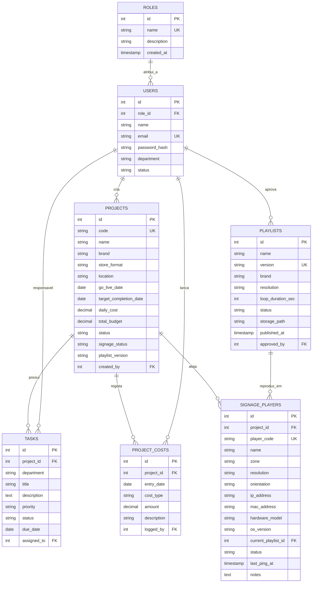
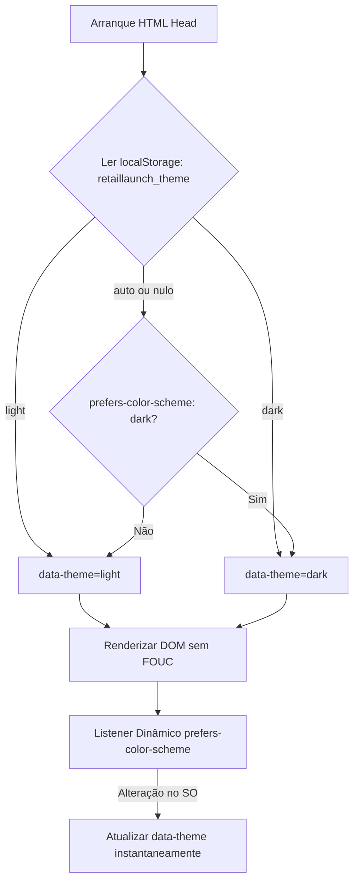

# Especificação da Arquitetura Técnica e Estrutural
## RetailLaunchOS • Gabinete Multimédia (Fnac / Darty)

Este documento documenta detalhadamente as estruturas técnicas, convenções de código, esquema de base de dados e camadas da aplicação implementadas no **RetailLaunchOS**.

---

## 1. Estrutura de Diretórios e Padrão Modular

A aplicação segue uma arquitetura modular por camadas (*Separation of Concerns*), permitindo escalar facilmente com novas APIs, autenticação e microserviços:

```text
RetailLaunchOS/
├── config/                          # Configurações globais e de infraestrutura
│   ├── app.js                       # Variáveis gerais, insígnias permitidas, portas
│   └── database.js                  # Caminhos e dialetos (SQLite / PostgreSQL)
├── database/                        # Camada de definição e persistência de dados
│   ├── schema.sql                   # DDL relacional (tabelas, índices e dados semente)
│   └── retaillaunch.sqlite          # Ficheiro de base de dados SQLite (gerado automaticamente)
├── public/                          # Ficheiros estáticos públicos
│   ├── css/
│   │   └── dashboard.css            # Folha de estilos vanilla com design system Fnac/Darty
│   └── js/                          # Scripts auxiliares e bibliotecas cliente
├── src/                             # Código-fonte principal da aplicação
│   ├── controllers/                 # Controladores REST e lógica de endpoints
│   │   ├── authController.js        # Autenticação JWT, troca de perfil e utilizadores
│   │   ├── projectController.js     # Gestão de aberturas de lojas e métricas
│   │   ├── taskController.js        # Checklist de marcos técnicos e progresso
│   │   ├── costController.js        # Registo de custos, diárias e sumários orçamentais
│   │   └── signageController.js     # Catálogo de playlists, versionamento e monitorização de telas
│   ├── database/                    # Abstração de ligação e auto-bootstrap da BD
│   │   └── db.js                    # Conexão nativa via node:sqlite com WAL e PRAGMAs
│   ├── middleware/                  # Intercetores de pedidos
│   │   └── authMiddleware.js        # JWT nativo HMAC-SHA256, autenticação e guardas RBAC
│   ├── models/                      # Camada de acesso aos dados (Data Access Objects)
│   │   ├── User.js                  # Utilizadores, hashes PBKDF2 e validação de credenciais
│   │   ├── Role.js                  # Perfis RBAC e matriz granular de permissões
│   │   ├── Project.js               # Consultas parametrizadas, criação e KPIs
│   │   ├── Task.js                  # Marcos técnicos e toggle de estado
│   │   ├── Cost.js                  # Custos diários, agregações e sumário financeiro
│   │   ├── Playlist.js              # Versões de playlists, resoluções e catálogo central
│   │   └── SignagePlayer.js         # Parque de telas, associação de playlists e telemetria ping
│   ├── routes/                      # Definição e mapeamento de rotas
│   │   ├── api/                     # Rotas de dados JSON (/api/v1/...)
│   │   │   └── projects.js          # Endpoints REST de projetos
│   │   └── web/                     # Rotas de visualização web HTML
│   │       └── dashboard.js         # Páginas do dashboard
│   └── views/                       # Vistas e templates da interface
│       └── pages/
│           └── dashboard.html       # Interface interativa do utilizador
├── Dockerfile                       # Contentorização baseada em Node.js 22 LTS Alpine
├── docker-compose.yml               # Orquestração para Synology Container Manager
├── package.json                     # Metadados e scripts de arranque
├── server.js                        # Servidor principal da aplicação (HTTP nativo/Express)
├── sync_github.sh                   # Script facilitador de commits e push para GitHub
├── MANUAL_SYNOLOGY.md               # Procedimentos de deploy e sync no NAS
└── MANUAL_UTILIZADOR_MODAIS.md      # Manual de utilização funcional para operadores
```

---

## 2. Base de Dados & Camada de Persistência

### 2.1. Motor SQLite Nativo (`node:sqlite`)
* **Implementação**: Em [`src/database/db.js`](file:///Users/daviscorreia/Antigravity%20/RetailLaunchOS/src/database/db.js), a aplicação utiliza o novo módulo nativo do Node.js (`node:sqlite` disponível em Node 22 e Node 24).
* **Vantagens**:
  * **Zero dependências externas**: Não requer pacotes npm como `better-sqlite3` ou `sqlite3`, eliminando compilações com `node-gyp` ou ferramentas C++ no Mac e no Synology NAS.
  * **Ultra-rápido**: Comunicação direta em memória e disco através de bindings C nativos do runtime V8.
* **Otimizações PRAGMA**:
  * `PRAGMA foreign_keys = ON;` — Garante a integridade referencial nas tabelas relacionais.
  * `PRAGMA journal_mode = WAL;` — Ativa o modo *Write-Ahead Logging* para leituras e escritas concorrentes sem bloqueios.

### 2.2. Mecanismo de Auto-Bootstrap
Na primeira execução da aplicação:
1. O ficheiro `src/database/db.js` verifica se a tabela `projects` existe na base de dados.
2. Caso não exista (base de dados nova ou limpa), lê e executa automaticamente o script [`database/schema.sql`](file:///Users/daviscorreia/Antigravity%20/RetailLaunchOS/database/schema.sql).
3. Cria todas as tabelas, índices e dados semente de teste sem intervenção manual.

### 2.3. Esquema Relacional de Dados (`database/schema.sql`)



---

## 3. Camada de Modelos (`src/models/`)

Os modelos encapsulam a lógica de negócio e queries SQL parametrizadas (evitando SQL Injection):

### 3.1. Modelo `Project.js`
* **`Project.findAll({ brand, status })`**:
  * Realiza `SELECT` com agregação de tarefas associadas (`total_tasks` e `completed_tasks`).
  * Calcula a percentagem real de progresso: `progress = round((completed_tasks / total_tasks) * 100)`.
* **`Project.findById(id)`**:
  * Suporta busca tanto por ID numérico como pelo código alfanumérico da loja (ex: `FNAC-CAS-2026`).
  * Agrupa os marcos técnicos (`tasks`), os custos diários registados (`project_costs`) e a contagem de ecrãs de Digital Signage.
* **`Project.create(data)`**:
  * Gera códigos de loja normalizados: `[MARCA]-[CIDADE]-[ANO]-[ALEATÓRIO]`.
  * Sanitiza e insere valores padrão para datas e orçamentos.
* **`Project.getKpis()`**:
  * Identifica a próxima abertura ativa: `SELECT * FROM projects WHERE go_live_date >= DATE('now') ORDER BY go_live_date ASC LIMIT 1`.
  * Calcula médias de custos diários, orçamentos globais e volume acumulado no mês.
  * Agrega em tempo real o rácio global de prontidão das telas (`signageReadiness`) e contadores operacionais (`signageStats`) diretamente a partir da tabela `signage_players`.

### 3.2. Modelo `Task.js` (Fase 2)
* **`Task.findByProject(projectId)`**:
  * Lista todas as tarefas associadas a uma loja, ordenadas por prioridade (`critical`, `high`, `medium`, `low`) e prazo de entrega.
  * Realiza `LEFT JOIN` com `users` para obter o nome do responsável.
* **`Task.create(data)`**:
  * Regista uma nova tarefa técnica vinculada a `project_id`.
* **`Task.toggleStatus(id)`**:
  * Alterna instantaneamente entre `concluido` (definindo `completed_at = CURRENT_TIMESTAMP`) e `pendente`.
* **`Task.update(id, data)` / `Task.delete(id)`**:
  * Atualiza metadados da tarefa ou elimina o registo.
* **`Task.getStats(projectId)`**:
  * Retorna contagens agregadas `{ total, completed, inProgress, pending, progress }` para recálculo imediato na interface.

### 3.3. Modelo `Cost.js` (Fase 3)
* **`Cost.findByProject(projectId)`**:
  * Lista todos os lançamentos financeiros vinculados ao projeto, com ordenação por data decrescente e `LEFT JOIN` com a tabela `users` para identificar o autor do registo.
* **`Cost.findById(id)`**:
  * Procura um registo de custo individual pelo seu ID primário.
* **`Cost.create(data)`**:
  * Insere uma nova despesa ou diária na tabela `project_costs` (`project_id`, `entry_date`, `cost_type`, `amount`, `description`, `logged_by`).
* **`Cost.delete(id)`**:
  * Remove um registo de despesa e devolve confirmação booleana.
* **`Cost.getProjectFinancialSummary(projectId)`**:
  * Calcula em tempo real o sumário financeiro da loja: `totalBudget`, `totalSpent`, `remainingBudget`, `budgetExecutionPercent`, `costsByType` (agrupamento por categoria de custo) e a lista completa de despesas.
* **`Cost.getGlobalSummary()`**:
  * Agrega os totais financeiros de todo o ecossistema: total gasto, despesa acumulada no mês corrente e distribuição de gastos por tipo de custo.

### 3.4. Modelo `Playlist.js` (Fase 4)
* **`Playlist.findAll({ brand, status, resolution })`**:
  * Lista todas as playlists do catálogo central com suporte a filtros dinâmicos por insígnia, estado de publicação e resolução.
  * Realiza agregação relacional com `signage_players` para contabilizar o número de telas associadas a cada playlist (`assigned_players_count`).
* **`Playlist.findById(id)`**:
  * Obtém os metadados da playlist pelo ID primário, incluindo o nome do utilizador aprovador (`approved_by_name`).
* **`Playlist.create(data)`**:
  * Regista uma nova versão de playlist (`name`, `version`, `brand`, `resolution`, `loop_duration_sec`, `storage_path`, `approved_by`).
* **`Playlist.updateStatus(id, status)`**:
  * Altera o ciclo de vida da playlist (`rascunho`, `aprovado`, `em_revisao`, `obsoleto`), registando o timestamp `published_at = CURRENT_TIMESTAMP` no ato de aprovação.
* **`Playlist.getStats()`**:
  * Fornece estatísticas consolidadas do repositório: total de playlists, ativas/aprovadas, em rascunho e obsoletas.

### 3.5. Modelo `SignagePlayer.js` (Fase 4)
* **`SignagePlayer.findByProject(projectId)`**:
  * Lista todas as telas/players instalados numa loja específica, com dados completos da playlist associada (`playlist_version`, `playlist_name`, `resolution`).
* **`SignagePlayer.findAll({ status, brand, projectId })`**:
  * Retorna o parque global de ecrãs de todas as lojas, com detalhes do projeto (loja, código, insígnia) e playlist vinculada.
* **`SignagePlayer.create(data)`**:
  * Adiciona um novo ecrã ao projeto com validação e geração automática de código (`player_code`), zona, orientação, IP, MAC e modelo de hardware.
* **`SignagePlayer.update(id, data)`**:
  * Permite reatribuir playlists, atualizar endereços IP, notas de instalação ou alterar o estado operacional.
* **`SignagePlayer.ping(id)`**:
  * Simula/executa telemetria e teste de conectividade com o player, atualizando `last_ping_at = CURRENT_TIMESTAMP` e definindo o estado como `online`.
* **`SignagePlayer.delete(id)`**:
  * Remove o registo de um ecrã/player da base de dados.
* **`SignagePlayer.getGlobalSignageStats()`**:
  * Consolida métricas em tempo real de todo o parque: total de ecrãs, contagem por estado (`online`, `offline`, `syncing`, `testing`) e rácio de prontidão (`readiness_percentage`).

### 3.6. Modelo `User.js` (Fase 5)
* **`User.verifyCredentials(email, password)`**:
  * Valida credenciais corporativas calculando o hash PBKDF2 (`node:crypto`) com 10.000 iterações ou aceitando a palavra-passe padrão de ambiente piloto (`fnac2026`). Retorna o utilizador com dados do seu perfil associado (`role_name`).
* **`User.findById(id)`**:
  * Retorna o operador por ID primário com o seu papel (`role`), departamento e estado.
* **`User.findByEmail(email)`**:
  * Localiza o utilizador pelo endereço de email institucional.
* **`User.findByRole(roleName)`**:
  * Permite comutação rápida de perfil (1-clique) no piloto, retornando o utilizador representativo de cada perfil (`admin`, `multimedia_user`, `store_manager`, `viewer`).
* **`User.findAll()`**:
  * Retorna todos os utilizadores registados no sistema com respetivo cargo e departamento.

### 3.7. Modelo `Role.js` (Fase 5)
* **`Role.findAll()`**:
  * Lista os 4 papéis do sistema e as suas descrições funcionais.
* **`Role.getPermissionsMatrix(roleName)`**:
  * Retorna o mapa booleano de privilégios (`canCreateProject`, `canDeleteProject`, `canManageTasks`, `canDeleteTasks`, `canManageCosts`, `canManageSignage`, `canPingPlayers`, `canManageUsers`).

---

## 4. Controladores e API REST (`projectController`, `taskController`, `costController`, `signageController`, `authController`)

A API segue os padrões RESTful com payloads JSON e códigos de resposta HTTP semânticos:

### 4.1. Endpoints de Lojas (`/api/v1/projects`)
| Método | Endpoint | Parâmetros | Permissões | Descrição |
| :--- | :--- | :--- | :---: | :--- |
| **GET** | `/api/v1/projects` | `?brand=Fnac&status=em_curso` | Todos | Lista todas as lojas com progresso e filtros opcionais |
| **GET** | `/api/v1/projects/kpis` | — | Todos | Retorna as métricas agregadas para os cartões de KPI |
| **GET** | `/api/v1/projects/:id` | `:id` (ID ou Código) | Todos | Detalha a loja, marcos técnicos e histórico de custos |
| **POST** | `/api/v1/projects` | Body JSON com dados da loja | `admin` | Cria uma nova abertura de loja na base de dados |
| **PUT** | `/api/v1/projects/:id` | Body JSON com campos a alterar | `admin`, `multimedia_user` | Atualiza campos de uma abertura existente |
| **PATCH**| `/api/v1/projects/:id/signage` | `{ signage_status, playlist_version }` | `admin`, `multimedia_user` | Atualiza parâmetros de Digital Signage e Playlist |
| **DELETE**| `/api/v1/projects/:id` | `:id` | `admin` | Remove um projeto e dependências em cascata |

### 4.2. Endpoints de Tarefas e Marcos (`/api/v1/projects/:id/tasks` & `/api/v1/tasks`)
| Método | Endpoint | Parâmetros | Permissões | Descrição |
| :--- | :--- | :--- | :---: | :--- |
| **GET** | `/api/v1/projects/:id/tasks` | `:id` (Project ID) | Todos | Lista tarefas e estatísticas de progresso da loja |
| **POST** | `/api/v1/projects/:id/tasks` | Body JSON com dados do marco | `admin`, `multimedia_user`, `store_manager` | Adiciona um novo marco técnico à loja |
| **PATCH**| `/api/v1/tasks/:id/toggle` | `:id` (Task ID) | `admin`, `multimedia_user`, `store_manager` | Alterna estado de conclusão com 1 clique |
| **PUT** | `/api/v1/tasks/:id` | Body JSON com alterações | `admin`, `multimedia_user`, `store_manager` | Atualiza detalhes de uma tarefa específica |
| **DELETE**| `/api/v1/tasks/:id` | `:id` (Task ID) | `admin`, `multimedia_user` | Elimina um marco técnico da base de dados |

### 4.3. Endpoints de Custos, Diárias e Orçamento (`/api/v1/projects/:id/costs` & `/api/v1/costs`) (Fase 3)
| Método | Endpoint | Parâmetros | Permissões | Descrição |
| :--- | :--- | :--- | :---: | :--- |
| **GET** | `/api/v1/projects/:id/costs` | `:id` (Project ID) | Todos | Retorna o sumário financeiro detalhado e histórico |
| **POST** | `/api/v1/projects/:id/costs` | Body JSON com dados da despesa | `admin`, `multimedia_user` | Regista uma nova diária ou custo de hardware/licença |
| **GET** | `/api/v1/costs/summary` | — | Todos | Sumário financeiro global consolidado |
| **DELETE**| `/api/v1/costs/:id` | `:id` (Cost ID) | `admin`, `multimedia_user` | Elimina um registo de despesa e recalcula saldo |

### 4.4. Endpoints de Digital Signage & Playlists (`/api/v1/signage` & `/api/v1/projects/:id/players`) (Fases 4 & 8)
| Método | Endpoint | Parâmetros | Permissões | Descrição |
| :--- | :--- | :--- | :---: | :--- |
| **GET** | `/api/v1/signage/stats` | — | Todos | Métricas globais de Digital Signage |
| **GET** | `/api/v1/signage/playlists`| `?brand=Fnac&status=aprovado` | Todos | Catálogo de playlists e contagem de telas vinculadas |
| **POST** | `/api/v1/signage/playlists`| Body JSON com versão/resolução | `admin`, `multimedia_user` | Cria uma nova versão de playlist no catálogo central |
| **PATCH**| `/api/v1/signage/playlists/:id/status` | `{ status }` | `admin`, `multimedia_user` | Altera estado da playlist |
| **GET** | `/api/v1/signage/players` | `?status=online&projectId=1` | Todos | Inventário global de ecrãs/players do catálogo e das lojas |
| **POST** | `/api/v1/signage/players` | Body JSON com dados da tela (`project_id` opcional) | `admin`, `multimedia_user` | Regista novo ecrã/player no catálogo global (em stock ou para loja) |
| **PATCH**| `/api/v1/signage/players/:id` | `:id` + Body JSON (`project_id`, `name`, `status`, etc.) | `admin`, `multimedia_user` | Atualiza hardware ou reatribui/desassocia projeto |
| **GET** | `/api/v1/projects/:id/players` | `:id` (Project ID) | Todos | Lista os ecrãs e players instalados na loja |
| **POST** | `/api/v1/projects/:id/players` | Body JSON com dados da tela | `admin`, `multimedia_user` | Associa um novo ecrã/player à loja especificada |
| **POST** | `/api/v1/signage/players/:id/ping` | `:id` (Player ID) | `admin`, `multimedia_user`, `store_manager` | Executa teste de conectividade (ping) |
| **DELETE**| `/api/v1/signage/players/:id` | `:id` (Player ID) | `admin`, `multimedia_user` | Remove permanentemente uma tela/player do catálogo |


### 4.5. Endpoints de Autenticação e Perfis (`/api/v1/auth`, `/api/v1/users`, `/api/v1/roles`) (Fases 5 & 7)
| Método | Endpoint | Parâmetros | Permissões | Descrição |
| :--- | :--- | :--- | :---: | :--- |
| **POST** | `/api/v1/auth/login` | `{ role }` ou `{ email, password }` | Público | Autentica operador e emite token JWT assinado |
| **GET** | `/api/v1/auth/me` | Bearer Token no cabeçalho | Autenticado | Retorna os dados do utilizador e matriz de permissões |
| **GET** | `/api/v1/users` | Bearer Token no cabeçalho | Autenticado | Lista todos os utilizadores com os seus cargos e estado |
| **POST** | `/api/v1/users` | Body JSON: `{ name, email, role_id, password?, department?, status? }` | `admin` | Cria um novo utilizador no sistema |
| **PATCH** | `/api/v1/users/:id` | `:id` (User ID) + Body JSON com campos a atualizar | `admin` | Atualiza dados de um utilizador (nome, email, perfil, departamento, password, estado) |
| **DELETE** | `/api/v1/users/:id` | `:id` (User ID) | `admin` | Desativa um utilizador (*soft delete* — status `inactive`, dados históricos preservados) |
| **GET** | `/api/v1/roles` | Bearer Token no cabeçalho | Autenticado | Retorna a matriz de permissões dos 4 perfis do sistema |


---

## 5. Segurança, RBAC & Tokens JWT Nativos (`src/middleware/authMiddleware.js`)

A camada de segurança foi construída segundo o princípio de **Zero Dependências NPM**, tirando pleno proveito do módulo nativo `node:crypto`:

### 5.1. Assinatura e Verificação de Tokens JWT
* **Algoritmo**: `HS256` (HMAC com SHA-256).
* **Estrutura**: `base64url(header) . base64url(payload) . signature`.
* **Segurança**:
  * Validação estrita de expiração (`exp`, configurada para 24 horas).
  * Chave secreta configurável via variável de ambiente `JWT_SECRET` (com fallback seguro para ambiente de desenvolvimento local).
  * Comparação criptográfica em tempo constante (`crypto.timingSafeEqual`) para proteção contra ataques de *timing*.

### 5.2. Guardas de Rotas RBAC no Backend
* Em [`server.js`](file:///Users/daviscorreia/Antigravity%20/RetailLaunchOS/server.js), o middleware `checkAuth(req, res, ...allowedRoles)` interceta cada rota de mutação (`POST`, `PUT`, `PATCH`, `DELETE`):
  1. Extrai o token do cabeçalho HTTP: `Authorization: Bearer <token>`.
  2. Se ausente ou inválido: responde de imediato com `HTTP 401 Unauthorized`.
  3. Se a função do utilizador não constar de `allowedRoles`: responde com `HTTP 403 Forbidden` e mensagem semântica em JSON.
  4. Se autorizado: injeta `req.user` e prossegue com a execução do controlador.

### 5.3. Interceção Global no Front-End (`window.fetch`)
* No cliente web (`dashboard.html`), o método global `window.fetch` é interceptado para injetar automaticamente o cabeçalho `Authorization: Bearer <token>` em todas as chamadas à API REST.
* Caso uma chamada retorne `401 Unauthorized` ou `403 Forbidden`, o sistema exibe um *toast* informativo de bloqueio e, se necessário, comuta para o modo de segurança.

---

## 6. Servidor de Aplicação (`server.js`)

* **Arquitetura Híbrida**: Concebido para arrancar tanto com o módulo nativo `http` do Node.js como com `Express` (caso venha a ser instalado).
* **Gestão de CORS**: Headers preflight (`OPTIONS`) configurados para permitir integrações de frontend externas ou de outras ferramentas da Fnac/Darty.
* **Streaming de Estáticos**: Serve ficheiros CSS, JS e HTML com os respetivos MIME types corretos (`text/css`, `text/html`, `application/javascript`).

---

## 7. Design System Oficial & Motor Multi-Tema (Fase 6)

A interface do **RetailLaunchOS** foi totalmente reformulada com um motor multi-tema tri-estado nativo e conformidade rigorosa com a identidade visual e cromática do Gabinete Multimédia Fnac / Darty.

### 7.1. Paleta Oficial Fnac & Darty e Cores Secundárias
As cores corporativas foram normalizadas no arquivo [`public/css/dashboard.css`](file:///Users/daviscorreia/Antigravity%20/RetailLaunchOS/public/css/dashboard.css) através de tokens CSS em `:root`:

```css
:root {
  /* Marca Fnac Oficial */
  --fnac-gold: #F5B027;
  --fnac-black: #000000;
  --fnac-white: #FFFFFF;
  --fnac-gold-hover: #e09d1b;
  --fnac-gold-glow: rgba(245, 176, 39, 0.28);

  /* Marca Darty Oficial */
  --darty-red: #E21212;
  --darty-black: #000000;
  --darty-white: #FFFFFF;
  --darty-red-hover: #c70d0d;
  --darty-red-glow: rgba(226, 18, 18, 0.28);

  /* Cores Secundárias (Ambas as Insígnias) */
  --sec-blue: #006EFA;
  --sec-green: #39D66A;
  --sec-yellow: #FFDB00;
  --sec-purple: #9147FF;
  --sec-teal: #28E4AB;
  --sec-pink: #FF7BF9;
}
```

### 7.2. Arquitetura de Tokens CSS Dinâmicos
A aplicação utiliza uma estratégia de variáveis CSS por escopo para garantir alternância instantânea de tema sem recarregar a página e sem duplicação de regras:

* **Modo Escuro (`:root, [data-theme="dark"]`)**:
  * `--bg-base: #090D16` (Obsidian profundo de alto contraste).
  * `--bg-surface: #101626` / `--bg-card: rgba(16, 22, 38, 0.85)` com *Glassmorphism* (`backdrop-filter: blur(16px)`).
  * `--text-main: #FFFFFF` / `--text-muted: #94A3B8`.
  * `--border-color: rgba(255, 255, 255, 0.08)`.
* **Modo Claro (`[data-theme="light"]`)**:
  * `--bg-base: #F8FAFC` (Slate neutro e confortável).
  * `--bg-surface: #FFFFFF` / `--bg-card: #FFFFFF` com sombras estruturais (`--shadow-card: 0 4px 20px rgba(0, 0, 0, 0.06)`).
  * `--text-main: #0F172A` (Preto ardósia de alto contraste para máxima legibilidade).
  * `--text-muted: #64748B`.
  * `--border-color: #E2E8F0`.

### 7.3. Motor Multi-Tema Tri-Estado e Prevenção de FOUC
O controle de temas no cliente web [`src/views/pages/dashboard.html`](file:///Users/daviscorreia/Antigravity%20/RetailLaunchOS/src/views/pages/dashboard.html) implementa três modos:
1. **`light` (Dia)**: Força a interface em modo claro.
2. **`dark` (Noite)**: Força a interface em modo escuro.
3. **`auto` (Sistema)**: Sincroniza dinamicamente com a preferência do sistema operativo do utilizador (`prefers-color-scheme`).



* **Eliminação de FOUC (*Flash of Unstyled Content*)**: Um script síncrono inline posicionado estrategicamente no `<head>`, antes de qualquer elemento visual ou folha de estilos secundária, determina o tema inicial e define `data-theme` na tag `<html>` em menos de 1 milissegundo.
* **Persistência**: A escolha é gravada na chave `retaillaunch_theme` do `localStorage`.
* **Controlo de UI**: Seletor segmentado com micro-animações no cabeçalho (`.theme-switcher-group`), exibindo o estado ativo com preenchimento em Fnac Gold (`#F5B027`) e tipografia em `#000000`.

---

## 8. Infraestrutura, Docker & Synology NAS

* **Contentorização (`Dockerfile`)**:
  * Imagem de base: `node:22-alpine` (menos de 60 MB).
  * Inclui o motor nativo `node:sqlite` sem necessidade de ferramentas de compilação C++.
* **Persistência no NAS (`docker-compose.yml`)**:
  * Mapeia o volume `retaillaunch_data` para `/app/database`, garantindo que o ficheiro `retaillaunch.sqlite` nunca é perdido ao atualizar ou reiniciar o contentor.
* **Sincronização (`sync_github.sh`)**:
  * Script de 1 comando para versionamento e push automático para a branch `main` do GitHub.
