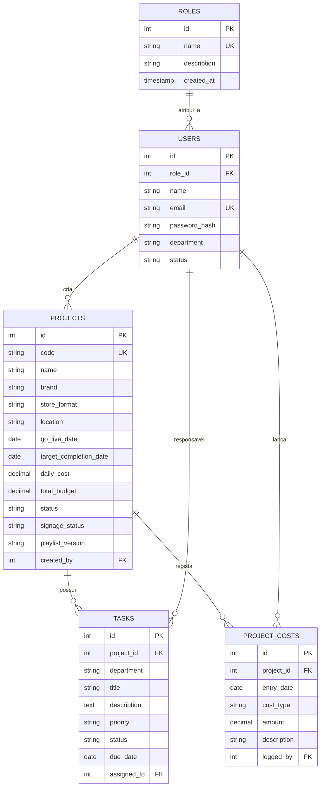

# Especificação da Arquitetura Técnica e Estrutural
## RetailLaunchOS • Gabinete Multimédia (Fnac / Darty)

Este documento documenta detalhadamente as estruturas técnicas, convenções de código, esquema de base de dados e camadas da aplicação implementadas no **RetailLaunchOS**.

---

## 1. Estrutura de Diretórios e Padrão Modular

A aplicação segue uma arquitetura modular por camadas (*Separation of Concerns*), permitindo escalar facilmente com novas APIs, autenticação e microserviços:

```text
RetailLaunchOS/
├── config/                          # Configurações globais e de infraestrutura
│   ├── app.js                       # Variáveis gerais, insígnias permitidas, portas
│   └── database.js                  # Caminhos e dialetos (SQLite / PostgreSQL)
├── database/                        # Camada de definição e persistência de dados
│   ├── schema.sql                   # DDL relacional (tabelas, índices e dados semente)
│   └── retaillaunch.sqlite          # Ficheiro de base de dados SQLite (gerado automaticamente)
├── public/                          # Ficheiros estáticos públicos
│   ├── css/
│   │   └── dashboard.css            # Folha de estilos vanilla com design system Fnac/Darty
│   └── js/                          # Scripts auxiliares e bibliotecas cliente
├── src/                             # Código-fonte principal da aplicação
│   ├── controllers/                 # Controladores REST e lógica de endpoints
│   │   └── projectController.js     # Gestão de aberturas de lojas e métricas
│   ├── database/                    # Abstração de ligação e auto-bootstrap da BD
│   │   └── db.js                    # Conexão nativa via node:sqlite com WAL e PRAGMAs
│   ├── middleware/                  # Intercetores de pedidos
│   │   └── authMiddleware.js        # Autenticação e controlo de permissões RBAC
│   ├── models/                      # Camada de acesso aos dados (Data Access Objects)
│   │   └── Project.js               # Consultas parametrizadas, criação e KPIs
│   ├── routes/                      # Definição e mapeamento de rotas
│   │   ├── api/                     # Rotas de dados JSON (/api/v1/...)
│   │   │   └── projects.js          # Endpoints REST de projetos
│   │   └── web/                     # Rotas de visualização web HTML
│   │       └── dashboard.js         # Páginas do dashboard
│   └── views/                       # Vistas e templates da interface
│       └── pages/
│           └── dashboard.html       # Interface interativa do utilizador
├── Dockerfile                       # Contentorização baseada em Node.js 22 LTS Alpine
├── docker-compose.yml               # Orquestração para Synology Container Manager
├── package.json                     # Metadados e scripts de arranque
├── server.js                        # Servidor principal da aplicação (HTTP nativo/Express)
├── sync_github.sh                   # Script facilitador de commits e push para GitHub
├── MANUAL_SYNOLOGY.md               # Procedimentos de deploy e sync no NAS
└── MANUAL_UTILIZADOR_MODAIS.md      # Manual de utilização funcional para operadores
```

---

## 2. Base de Dados & Camada de Persistência

### 2.1. Motor SQLite Nativo (`node:sqlite`)
* **Implementação**: Em [`src/database/db.js`](file:///Users/daviscorreia/Antigravity%20/RetailLaunchOS/src/database/db.js), a aplicação utiliza o novo módulo nativo do Node.js (`node:sqlite` disponível em Node 22 e Node 24).
* **Vantagens**:
  * **Zero dependências externas**: Não requer pacotes npm como `better-sqlite3` ou `sqlite3`, eliminando compilações com `node-gyp` ou ferramentas C++ no Mac e no Synology NAS.
  * **Ultra-rápido**: Comunicação direta em memória e disco através de bindings C nativos do runtime V8.
* **Otimizações PRAGMA**:
  * `PRAGMA foreign_keys = ON;` — Garante a integridade referencial nas tabelas relacionais.
  * `PRAGMA journal_mode = WAL;` — Ativa o modo *Write-Ahead Logging* para leituras e escritas concorrentes sem bloqueios.

### 2.2. Mecanismo de Auto-Bootstrap
Na primeira execução da aplicação:
1. O ficheiro `src/database/db.js` verifica se a tabela `projects` existe na base de dados.
2. Caso não exista (base de dados nova ou limpa), lê e executa automaticamente o script [`database/schema.sql`](file:///Users/daviscorreia/Antigravity%20/RetailLaunchOS/database/schema.sql).
3. Cria todas as tabelas, índices e dados semente de teste sem intervenção manual.

### 2.3. Esquema Relacional de Dados (`database/schema.sql`)



---

## 3. Camada de Modelos (`src/models/Project.js`)

O modelo encapsula toda a lógica de negócio e queries parametrizadas (evitando SQL Injection):

* **`Project.findAll({ brand, status })`**:
  * Realiza `SELECT` com agregação de tarefas associadas (`total_tasks` e `completed_tasks`).
  * Calcula a percentagem real de progresso: `progress = round((completed_tasks / total_tasks) * 100)`.
* **`Project.findById(id)`**:
  * Suporta busca tanto por ID numérico como pelo código alfanumérico da loja (ex: `FNAC-CAS-2026`).
  * Agrupa os marcos técnicos (`tasks`) e os custos diários registados (`project_costs`).
* **`Project.create(data)`**:
  * Gera códigos de loja normalizados: `[MARCA]-[CIDADE]-[ANO]-[ALEATÓRIO]`.
  * Sanitiza e insere valores padrão para datas e orçamentos.
* **`Project.getKpis()`**:
  * Identifica a próxima abertura ativa: `SELECT * FROM projects WHERE go_live_date >= DATE('now') ORDER BY go_live_date ASC LIMIT 1`.
  * Calcula médias de custos diários, orçamentos globais e volume acumulado no mês.

---

## 4. Controladores e API REST (`src/controllers/projectController.js`)

A API segue os padrões RESTful com payloads JSON e códigos de resposta HTTP semânticos:

| Método | Endpoint | Parâmetros | Descrição |
| :--- | :--- | :--- | :--- |
| **GET** | `/api/v1/projects` | `?brand=Fnac&status=em_curso` | Lista todas as lojas com progresso e filtros opcionais |
| **GET** | `/api/v1/projects/kpis` | — | Retorna as métricas agregadas para os cartões de KPI |
| **GET** | `/api/v1/projects/:id` | `:id` (ID ou Código) | Detalha a loja, marcos técnicos e histórico de custos |
| **POST** | `/api/v1/projects` | Body JSON com dados da loja | Cria uma nova abertura de loja na base de dados |
| **PUT** | `/api/v1/projects/:id` | Body JSON com campos a alterar | Atualiza campos de uma abertura existente |
| **DELETE**| `/api/v1/projects/:id` | `:id` | Remove um projeto e dependências em cascata |

---

## 5. Servidor de Aplicação (`server.js`)

* **Arquitetura Híbrida**: Concebido para arrancar tanto com o módulo nativo `http` do Node.js como com `Express` (caso venha a ser instalado).
* **Gestão de CORS**: Headers preflight (`OPTIONS`) configurados para permitir integrações de frontend externas ou de outras ferramentas da Fnac/Darty.
* **Streaming de Estáticos**: Serve ficheiros CSS, JS e HTML com os respetivos MIME types corretos (`text/css`, `text/html`, `application/javascript`).

---

## 6. Front-End & Design System (`public/css/dashboard.css`)

* **Estética**: Dark mode elegante com fundo obsidian (`#090d16`), cartões com efeito de vidro (*Glassmorphism* com `backdrop-filter: blur(16px)`), e sombras suaves.
* **Identidade de Marca**:
  * **Fnac**: Dourado/Âmbar (`#F59E0B`), com badges translúcidos e barras de progresso com gradiente de ouro.
  * **Darty**: Vermelho vivo (`#EF4444`), com badges em tons de fogo e destaques vibrantes.
* **Tipografia**: *Plus Jakarta Sans* para títulos e interface geral; *JetBrains Mono* com números tabulares para relógios, valores em euros e contagens.

---

## 7. Infraestrutura, Docker & Synology NAS

* **Contentorização (`Dockerfile`)**:
  * Imagem de base: `node:22-alpine` (menos de 60 MB).
  * Inclui o motor nativo `node:sqlite`.
* **Persistência no NAS (`docker-compose.yml`)**:
  * Mapeia o volume `retaillaunch_data` para `/app/database`, garantindo que o ficheiro `retaillaunch.sqlite` nunca é perdido ao atualizar ou reiniciar o contentor.
* **Sincronização (`sync_github.sh`)**:
  * Script de 1 comando para versionamento e push automático para a branch `main` do GitHub.
