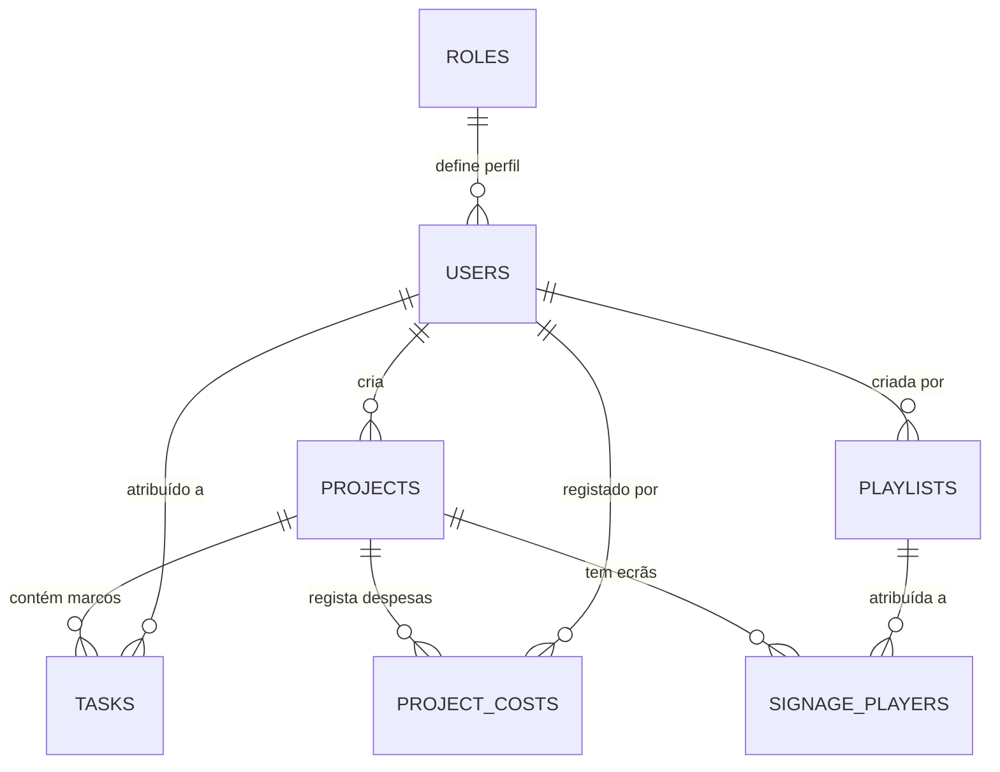

# Manual de Gestão & Arquitetura da Base de Dados
## RetailLaunchOS • Gabinete Multimédia (Fnac / Darty)

**Última Atualização**: 07 de Setembro de 2026  
**Documento de Referência**: `MANUAL_BASE_DE_DADOS.md`  
**Tecnologia**: SQLite 3 Nativo (`node:sqlite` no Node.js 22+)

---

## 1. Identificação do Motor de Dados

O **RetailLaunchOS** utiliza o motor relacional **SQLite 3** através da biblioteca síncrona de alta performance **`node:sqlite`** (`DatabaseSync`), incluída nativamente no núcleo do Node.js a partir da versão 22.

### Vantagens Desta Abordagem:
* **Zero Dependências Externas**: Não necessita de compilações C++ nativas (`better-sqlite3`, `node-gyp`), nem de daemons ou servidores de base de dados externos a correr em portas separadas.
* **Auto-Contido e Portátil**: Toda a informação do sistema reside em ficheiros locais protegidos, facilitando cópias de segurança imediatas e transporte integral entre máquinas ou servidores.
* **Desempenho com Modo WAL**: A base de dados opera com `PRAGMA journal_mode = WAL` (*Write-Ahead Logging*), permitindo leituras e escritas concorrentes sem bloqueio de ficheiro.
* **Integridade Referencial**: Opera com `PRAGMA foreign_keys = ON`, garantindo integridade estrita nas relações entre lojas, tarefas, despesas, ecrãs e playlists.

---

## 2. Localização Física dos Ficheiros

No ambiente de desenvolvimento local e no contentor de produção, os dados estão localizados no diretório `database/`:

| Ficheiro | Tipo | Descrição |
| :--- | :---: | :--- |
| **`database/retaillaunch.sqlite`** | **Ficheiro Principal** | Ficheiro binário da base de dados SQLite onde residem todas as tabelas, índices e dados persistidos. |
| **`database/retaillaunch.sqlite-wal`** | *Buffer WAL (Temporário)* | Ficheiro de *Write-Ahead Log* onde são escritas as transações concorrentes antes de serem consolidadas no ficheiro principal. |
| **`database/retaillaunch.sqlite-shm`** | *Memória Partilhada (Temporário)* | Ficheiro de índice em memória partilhada utilizado pelo SQLite para coordenar o acesso ao ficheiro WAL. |
| **`database/schema.sql`** | *Esquema & Seed DDL* | Ficheiro SQL que declara a estrutura integral das tabelas, índices e sementes padrão de teste do Gabinete Multimédia. |

> [!NOTE]
> **Caminho absoluto no ambiente local (Mac)**:  
> `/Users/daviscorreia/Antigravity /RetailLaunchOS/database/retaillaunch.sqlite`

---

## 3. Estrutura do Esquema Relacional

A base de dados é composta por **7 tabelas relacionais** estruturadas para o controlo operacional das aberturas:



### Resumo das Tabelas:

1. **`roles`**: Perfis de acesso ao sistema (`admin`, `multimedia_user`, `store_manager`, `viewer`).
2. **`users`**: Utilizadores autorizados, passwords cifradas (`password_hash`), departamento e estado.
3. **`projects`**: Cadastro das lojas e aberturas Fnac / Darty (código único, marca, formato, morada, datas de inauguração/entrega, diária técnica, orçamento total alocado, status da obra e status de digital signage).
4. **`tasks`**: Checklist de marcos técnicos por departamento (`Multimédia & Telas`, `Redes & IT`, `Som & Iluminação`), com prioridades (`critical`, `high`, etc.) e prazos.
5. **`project_costs`**: Histórico detalhado de despesas e diárias operacionais imputadas a cada loja (`hardware_multimedia`, `licenciamento_telas`, `tecnico_externo`, `infraestrutura_rede`).
6. **`playlists`**: Catálogo central de versões de conteúdos de Digital Signage, com resoluções (`3840x2160 4K`, `1920x1080 FHD`, `Video Wall LED`), duração de loop e estado (`draft`, `em_validacao`, `publicada`, `arquivada`).
7. **`signage_players`**: Catálogo de hardware físico (displays, totens, videowalls e media players BrightSign, Samsung Tizen, LG webOS), endereços IP, MAC addresses, status operacional (`online`, `testing`, `syncing`, `offline`), resolução e associação opcional a lojas (`project_id`).

---

## 4. Ciclo de Vida dos Dados & Auto-Bootstrap

A gestão do ciclo de vida da base de dados é controlada centralmente pelo módulo [`src/database/db.js`](file:///Users/daviscorreia/Antigravity%20/RetailLaunchOS/src/database/db.js):

1. **Arranque Automático (Auto-Bootstrap)**:
   * Ao iniciar a aplicação (`node server.js` ou contentor Docker), o ficheiro `db.js` verifica se a base de dados já possui as tabelas essenciais.
   * Caso o ficheiro `retaillaunch.sqlite` ainda não exista (ex.: após clonar o repositório do zero), o sistema compila e executa instantaneamente o ficheiro [`database/schema.sql`](file:///Users/daviscorreia/Antigravity%20/RetailLaunchOS/database/schema.sql), criando toda a estrutura relacional e os dados-semente de demonstração.
2. **Migrações Transparentes**:
   * O método `migrateSchema()` deteta alterações de esquema em tempo de execução sem perda de dados históricos (ex.: migração da Fase 8 que tornou `project_id` opcional na tabela `signage_players` para suportar o catálogo global de hardware em armazém).

---

## 5. Persistência em Docker e Synology NAS

No cenário de deploy através de Docker ou no Synology Container Manager, a persistência é assegurada através de volumes montados no `docker-compose.yml`:

```yaml
version: '3.8'

services:
  app:
    build: .
    container_name: retaillaunch-os
    restart: unless-stopped
    ports:
      - "3000:3000"
    volumes:
      # Montagem persistente da pasta de base de dados no disco rígido do host
      - ./database:/app/database
    environment:
      - PORT=3000
      - NODE_ENV=production
```

> [!IMPORTANT]
> **Garantia de Persistência**:  
> Graças à linha `- ./database:/app/database`, o ficheiro `retaillaunch.sqlite` é gravado no disco físico do Synology NAS. Qualquer paragem, reinício ou atualização da imagem Docker preserva integralmente todas as lojas, despesas e ecrãs cadastrados.

---

## 6. Procedimentos de Cópia de Segurança (Backup) & Restauro

### 6.1. Como Criar uma Cópia de Segurança Manual
Para salvaguardar os dados do sistema, basta copiar o ficheiro `retaillaunch.sqlite` para uma pasta de backup externa:

```bash
# Exemplo de backup com data e hora no terminal:
cp database/retaillaunch.sqlite "database/backup_retaillaunch_$(date +'%Y%m%d_%H%M%S').sqlite"
```

### 6.2. Backup Online Seguro com SQLite CLI
Se a aplicação estiver a receber pedidos concorrentes em modo WAL, pode utilizar o comando nativo do SQLite para criar um snapshot atómico:

```bash
sqlite3 database/retaillaunch.sqlite ".backup 'database/backup_retaillaunch.sqlite'"
```

### 6.3. Procedimento de Restauro
Para restaurar um backup anterior:
1. Parar a aplicação (`Ctrl + C` no terminal ou parar o contentor no Synology).
2. Substituir o ficheiro `database/retaillaunch.sqlite` pela cópia de segurança pretendida.
3. Se existirem ficheiros `retaillaunch.sqlite-wal` e `retaillaunch.sqlite-shm`, eliminá-los para forçar o SQLite a ler o novo ficheiro principal.
4. Reiniciar a aplicação.

---

## 7. Como Consultar / Abrir a Base de Dados com Ferramentas Gráficas

Caso os administradores ou equipas de IT pretendam inspecionar os registos brutos da base de dados, podem abrir diretamente o ficheiro `database/retaillaunch.sqlite` através de ferramentas visuais:

1. **DB Browser for SQLite** *(Recomendado - Gratuito e Open Source)*:
   * Download: [sqlitebrowser.org](https://sqlitebrowser.org/)
   * Permite navegar pelas tabelas, executar queries SQL, editar dados em formato folha de cálculo e exportar relatórios.
2. **DBeaver Community**:
   * Suporta ligação direta criando uma nova ligação de tipo *SQLite* e apontando para o ficheiro `retaillaunch.sqlite`.
3. **Extensão SQLite Viewer para VS Code / Antigravity IDE**:
   * Permite abrir e visualizar o ficheiro `.sqlite` diretamente no editor de código com um clique.
4. **Linha de Comandos (CLI)**:
   ```bash
   sqlite3 database/retaillaunch.sqlite
   sqlite> .tables
   sqlite> SELECT name, brand, go_live_date, status FROM projects;
   sqlite> .exit
   ```

---

## 8. Configuração de Variáveis de Ambiente

O ficheiro [`config/database.js`](file:///Users/daviscorreia/Antigravity%20/RetailLaunchOS/config/database.js) permite customizar o dialecto ou o caminho de armazenamento através de variáveis de ambiente:

| Variável | Valor Padrão | Descrição |
| :--- | :--- | :--- |
| `DB_DIALECT` | `sqlite` | Dialeto ativo (`sqlite` ou `postgres`). |
| `DB_STORAGE` | `database/retaillaunch.sqlite` | Caminho personalizado para o ficheiro da base de dados. |
