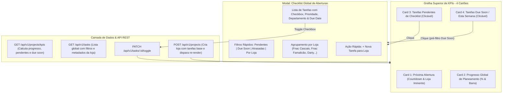

# Plano de Implementação • Fase 10: Foco Operacional em Planeamento & Gestão de Checklists
## RetailLaunchOS • Gabinete Multimédia (Fnac / Darty)

**Data de Planeamento**: 08 de Setembro de 2026  
**Fase**: Fase 10 • Operações de Planeamento & Gestão de Checklists  
**Estado**: ⏳ Aguarda Aprovação do Utilizador

---

## 1. Visão Geral & Contexto

O objetivo central do **RetailLaunchOS** é planear, coordenar e executar as aberturas e *refits* de lojas para a **Fnac** e **Darty**. Com a maturidade das fases anteriores, a interface de topo do Dashboard deve evoluir de métricas gerais de infraestrutura para um centro de alerta e ação operacional imediata.

Neste sentido, a grelha superior do Dashboard será reestruturada:
- **Retirar** o cartão *"Infraestrutura Multimédia"* (que reunia dados estáticos/secundários do parque).
- **Integrar 3 Novos Cartões de KPIs Operacionais** no seu lugar (mantendo à esquerda o relógio decrescente do cartão *"Próxima Abertura"*):
  1. **Progresso Global de Planeamento**: Percentagem agregada e barra de progresso das lojas ativas em fase de planeamento/abertura, evidenciando o ritmo real de execução das tarefas técnicas.
  2. **Tarefas Pendentes de Checklist**: Quantitativo consolidado de todas as tarefas não concluídas de todas as lojas em planeamento. **Clicável para abrir a Checklist Global de Tarefas**.
  3. **Tarefas "Due Soon" (Esta Semana)**: Quantitativo de tarefas cuja data limite (*Due Date*) recai na semana em questão (e tarefas em atraso). **Clicável para abrir a Checklist Global filtrada com foco imediato nos alertas da semana**.
- **Novo Modal / Painel "Checklist Global de Aberturas"**:
  - Apresenta as tarefas agrupadas por loja (com a marca, formato, data de go-live e barra de progresso da loja).
  - Permite interatividade direta: marcar/desmarcar conclusão via checkbox, alterar prioridades/datas e criar novas tarefas.
  - Filtros rápidos integrados: *Todas as Pendentes*, *Due Soon / Esta Semana*, *Em Atraso*, *Concluídas*, e filtro por loja específica.
- **Garantia de Reatividade Integral**: Ao registar uma nova loja no modal de abertura (ou ao alternar tarefas), todos os contadores dos cartões de topo, checklists e tabela inferior recalculam e atualizam instantaneamente.

---

## 2. Desenho Arquitetural & Componentes Afetados



---

## 3. Alterações Detalhadas por Módulo

### 3.1. Backend (`src/models/`, `src/controllers/`, `server.js`)

#### A. `src/models/Task.js`
- Criar método estático `Task.findAllGlobal(filters)`:
  - Junta `tasks` com `projects` e `users`.
  - Filtra apenas lojas ativas (`status IN ('planeamento', 'em_curso')`).
  - Suporta filtros: `status` ('pending', 'completed', 'all'), `scope` ('due_soon', 'overdue', 'all'), `project_id`.
  - Calcula flags dinâmicas: `is_overdue` (data vencida e não concluída), `is_due_soon` (data dentro da semana corrente), `days_left`.
  - Ordenação prioritária: atrasadas primeiro, seguidas de urgência de prioridade (`critical` > `high` > `medium` > `low`) e data limite.

#### B. `src/models/Project.js`
- Enriquecer `Project.getKpis()`:
  - **`planningProgress`**: Cálculo do progresso médio e agregado de todas as lojas em planeamento/em curso:
    $$\text{Progresso Global} = \frac{\sum \text{Tarefas Concluídas}}{\sum \text{Total de Tarefas}} \times 100$$
  - **`pendingTasks`**:
    - `total`: Total de tarefas pendentes (`status != 'concluido'`) nas lojas em planeamento.
    - `storesCount`: Número de lojas com tarefas pendentes.
    - `byPriority`: Contagem por prioridade (`critical`, `high`, `medium`, `low`).
  - **`dueSoonTasks`**:
    - `total`: Tarefas com `due_date` na semana corrente (ou próximos 7 dias) que ainda não estejam concluídas.
    - `overdueCount`: Tarefas que já ultrapassaram o prazo e continuam por concluir.
    - `thisWeekCount`: Tarefas estritamente com prazo para a semana corrente.
- No método `Project.create()`:
  - Ao registar uma nova loja, criar automaticamente tarefas padrão de checklist de abertura (vistoria técnica de telas, configuração de rede e IPs de players, validação de áudio, deploy de playlist), para que a nova loja nasça imediatamente integrada no sistema de monitorização e checklist.

#### C. `src/controllers/taskController.js` & `server.js`
- Adicionar `taskController.getAllGlobal(req, res)` mapeado na rota `GET /api/v1/tasks`.

---

### 3.2. Frontend (`src/views/pages/dashboard.html` & `public/css/dashboard.css`)

#### A. Grelha Superior de KPIs (`.kpi-grid`)
- Substituir o bloco HTML do antigo cartão *"Infraestrutura Multimédia"* pelos **3 novos cartões**:
  1. **Card 2: Progresso Global de Planeamento**:
     - Título: *"Progresso do Planeamento"*
     - Valor em destaque: `XX%`
     - Barra de progresso visual estilizada com preenchimento dourado/azul.
     - Subtítulo: *"Taxa média de conclusão em X lojas ativas"*.
  2. **Card 3: Tarefas Pendentes de Checklist**:
     - Título: *"Tarefas em Checklist"*
     - Valor em destaque: `X Tarefas`
     - Subtítulo: *"Pendentes de conclusão"*.
     - Indicador interativo: *"Ver Checklist Global ➔"*.
     - `onclick="openGlobalTasksModal('pending')"` com cursor pointer e efeito hover.
  3. **Card 4: Tarefas "Due Soon" (Esta Semana)**:
     - Título: *"Due Soon • Esta Semana"*
     - Valor em destaque: `X Tarefas`
     - Subtítulo: *"Prazos a vencer nos próximos dias"*.
     - Badge de alerta dinâmico (com aviso se houver tarefas em atraso).
     - Indicador interativo: *"Ver Alertas ➔"*.
     - `onclick="openGlobalTasksModal('due_soon')"` com cursor pointer e efeito hover.

#### B. Modal "Checklist Global de Aberturas" (`#modalGlobalTasks`)
- Novo componente estruturado:
  - **Header**: Título descritivo, resumo de estatísticas e botão de fechar.
  - **Filtros Rápidos no Topo**:
    - Chips: `Todas as Pendentes`, `Due Soon (Esta Semana)`, `Em Atraso`, `Concluídas`, `Ver Todas`.
    - Dropdown: Filtrar por Loja específica.
  - **Lista Agrupada por Loja**:
    - Para cada loja: Cabeçalho com marca (Fnac/Darty), código, data de inauguração e percentagem de conclusão da loja.
    - Linhas de tarefas interativas: Checkbox direta para alternar status (atualiza a tarefa e todo o Dashboard em background com feedback visual), badge de departamento, badge de prioridade e badge temporal de Due Date (*"Hoje"*, *"Amanhã"*, *"Em atraso"*, etc.).
    - Botão para adicionar nova tarefa diretamente associada àquela loja.

#### C. Atualização e Reatividade Global
- O listener de submissão do formulário de nova abertura (`submitNovaAbertura`) já executa `await loadProjects()` e `await loadKpis()`.
- Garantir que qualquer criação de loja, criação de tarefa ou marcação de checkbox atualiza instantaneamente:
  - Os 4 cartões de topo da grelha de KPIs.
  - A barra de resumo de Aberturas no cabeçalho da tabela.
  - A tabela de Aberturas em Curso.
  - E o próprio modal de tarefas globais caso esteja aberto.

#### D. Estilos CSS (`public/css/dashboard.css`)
- Reconfigurar `.kpi-grid` para 4 colunas em desktop widescreen:
  ```css
  .kpi-grid {
    display: grid;
    grid-template-columns: minmax(320px, 360px) repeat(3, 1fr);
    gap: 20px;
  }
  @media (max-width: 1200px) {
    .kpi-grid {
      grid-template-columns: repeat(2, 1fr);
    }
  }
  @media (max-width: 680px) {
    .kpi-grid {
      grid-template-columns: 1fr;
    }
  }
  ```
- Estilos para os novos cards de KPIs operacionais (`.kpi-interactive`, hover effects, badges de alerta).
- Estilos completos para `#modalGlobalTasks`, cartões de loja e checklist compacta de alta densidade.

---

### 3.3. Documentação Contínua (`AGENTS.md`)
1. **`MANUAL_UTILIZADOR_MODAIS.md`**: Documentar os 3 novos cartões de topo, como utilizar a Checklist Global e os filtros de *Due Soon*.
2. **`ARQUITETURA_TECNICA.md`**: Adicionar a Secção 10 com a especificação da Checklist Global e endpoints de agregação.
3. **`docs/walkthroughs/FASE_10_WALKTHROUGH.md`**: Relatório de validação com screenshots e chamadas à API.
4. **`docs/README.md`**: Registo da Fase 10 na matriz de Disaster Recovery.

---

## 4. Plano de Verificação

### Testes Automatizados & Validação de Sintaxe
- `node --check server.js`
- `node --check src/models/Task.js`
- `node --check src/models/Project.js`
- `node --check src/controllers/taskController.js`

### Testes de API REST
1. `GET /api/v1/projects/kpis`:
   - Validar se retorna `planningProgress`, `pendingTasks` e `dueSoonTasks` com números exatos da base de dados SQLite.
2. `GET /api/v1/tasks?status=pending`:
   - Validar retorno de tarefas não concluídas com dados da loja associada.
3. `GET /api/v1/tasks?scope=due_soon`:
   - Validar retorno estrito de tarefas que vencem na semana corrente ou em atraso.
4. `PATCH /api/v1/tasks/:id/toggle`:
   - Validar alternância de estado e impacto no recálculo dos KPIs.
5. `POST /api/v1/projects`:
   - Criar uma nova loja e verificar se os contadores de tarefas e progresso reagem em tempo real.
